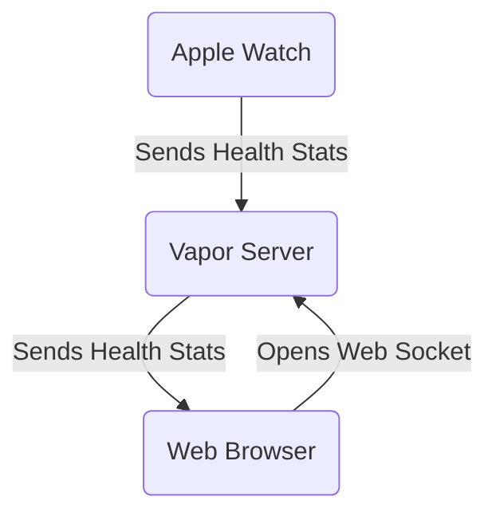

# From Server-Side Swift to Fitness Streaming: The Birth of gBeat

## My Introduction to Server-Side Swift

In 2018, I attended the try! Swift conference in New York City. As an iOS developer, I was intrigued by a workshop titled "Build a Cloud Native Swift App." At the time, Swift was still relatively new and primarily associated with iOS development. The idea of using it for cloud applications seemed almost far-fetched.

During the workshop, held in an IBM building, I was introduced to Kitura, an open-source web framework for Swift. While interesting, it didn't immediately click for me. However, upon returning home, my curiosity led me to explore other server-side Swift options. That's when I discovered Vapor.

Vapor was a revelation. It was simple, fast, and leveraged all the advantages of Swift that I had come to appreciate in iOS development. I quickly fell in love with the framework and knew I wanted to build something with it.

## The Birth of Heartwitch

As I pondered what kind of app to build with Vapor, I wanted to create something unique and challenging. I was already into fitness and gaming, often playing with Nintendo Switch Joy-Cons while working out on an elliptical. This multitasking approach to exercise got me thinking: what if I could combine fitness data with live streaming?

I was also fascinated by the speedrunning community, where gamers attempt to complete video games as quickly as possible. I noticed that many speedrunners displayed their heart rate during streams, adding an extra layer of excitement for viewers.

These ideas converged into Heartwitch, an app that would allow users to live stream their heart rate data during workouts or gaming sessions. The concept was to use Swift on both ends of the spectrum - from the tiny Apple Watch to a powerful server running Vapor.

## Pivoting to gBeat

While developing Heartwitch, I received an email from Chris, a potential collaborator. Chris saw the potential in the heart rate streaming idea but suggested a pivot: why not focus on the fitness industry, especially given the surge in home workouts during the pandemic?

This conversation led to the birth of gBeat, a more focused application designed for fitness instructors and participants. gBeat would allow instructors to live stream their heart rate and other fitness metrics to class participants, and vice versa. This pivot aligned perfectly with the growing trend of virtual fitness classes and personalized workout experiences.

## Behind the Scenes: Swift Magic

Both Heartwitch and gBeat rely on the power of Swift to seamlessly transmit heart rate data from an Apple Watch to a live stream. Here's a simplified overview of how it works:

1. **Data Collection**: The Apple Watch app uses HealthKit to collect real-time heart rate data.

2. **Data Transmission**: The heart rate data is sent from the watch to the iPhone app using WatchConnectivity framework.

3. **Server Communication**: The iPhone app makes a POST request to our Vapor server, sending the heart rate data.

4. **WebSocket Magic**: Our Vapor server, built with Swift, uses WebSockets to maintain an open connection with the user's browser.

5. **Real-time Updates**: As new heart rate data comes in, the server pushes it through the WebSocket to the browser, updating the live stream in real-time.

6. **Redis for Scalability**: To handle multiple concurrent users and ensure low latency, we use Redis as a pub/sub system. The Vapor server publishes heart rate updates to Redis, which then distributes the data to all relevant WebSocket connections.

This Swift-powered pipeline ensures that heart rate data flows smoothly and quickly from the Apple Watch to viewers' screens, creating an engaging and interactive fitness streaming experience.

## The gBeat Ecosystem

Now that we've covered the journey from server-side Swift to the creation of gBeat, let's dive into how the gBeat ecosystem actually works. This will give you a clearer picture of how we've leveraged Swift to create a seamless fitness streaming experience.

### How the Applications Work

At its core, gBeat relies on three main components: the Apple Watch, our Vapor server, and the web browser. Here's a simplified flowchart of how these components interact:

1. The Apple Watch collects health stats (like heart rate) and sends them to our Vapor server.
2. The Vapor server, built with Swift, processes this data and prepares it for transmission.
3. A web browser opens a WebSocket connection to the Vapor server.
4. The Vapor server sends the health stats to the connected web browsers in real-time.

This system allows for real-time streaming of health data from the Apple Watch to any connected web browser, creating an interactive and engaging fitness experience.

### Integration with Apple Watch

The Apple Watch is a crucial component of the gBeat ecosystem. We've developed a native watchOS app that integrates seamlessly with HealthKit to collect real-time health data. This deep integration allows us to access accurate, up-to-the-second health stats, which is essential for live fitness streaming.

Our watchOS app also leverages Apple's Push Notification service to alert users when their instructor starts a class, ensuring participants never miss a session.

### User Experience Highlights

We've designed gBeat with two primary user types in mind: participants and instructors. Here's how the experience typically unfolds for each:

#### For Participants:

1. User signs in with Apple for a seamless, secure authentication process.
2. User enters a code for the workout class they wish to join.
3. User starts their workout on their Apple Watch.

#### For Instructors:

1. Instructor signs in with Apple.
2. Instructor creates a workout class, with the option to set a schedule for recurring sessions.
3. When ready, the instructor starts the class.
4. Instructor shares their web browser window in their chosen streaming platform.
5. Instructor shares the workout class code with participants.
6. The class begins!

This streamlined process allows for quick setup and easy participation, whether you're leading a class or joining one.

By leveraging the power of Swift across the entire stack - from the Apple Watch to our Vapor server - we've created a robust, efficient system for real-time fitness data streaming. This full-stack Swift approach allows us to maintain type safety, share code between different parts of the system, and take full advantage of Swift's performance benefits.

In our next post, we'll dive deeper into the technical challenges we faced while building this ecosystem and how we leveraged Swift's unique features to overcome them. Stay tuned!