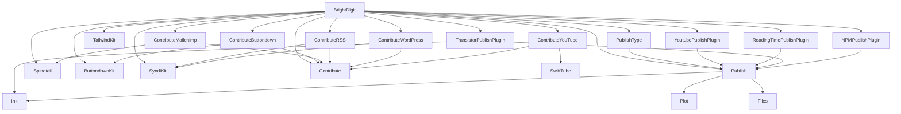

# Merge & Tag — De-vendoring the Package Graph

**Goal:** turn the 20 first-party packages into standalone versioned packages
consumed by `.package(url:…, from:…)`. Tag **bottom-up by wave**: a package can
only be tagged once every in-repo package it depends on already has a release.

**Root checkpoint PR (stays open until every first-party dep is a released tag):**
[brightdigit.com#161](https://github.com/brightdigit/brightdigit.com/pull/161)
on `release/branch-based-devendoring`.

Within a wave, packages can proceed in parallel. Do not tag a package until every
in-repo dependency it needs is already tagged.

> **~~Coordinated landing~~ — discharged 2026-07-24.** brightdigit/Contribute
> [#19](https://github.com/brightdigit/Contribute/pull/19) is **merged** (`a749708`), followed by
> [#18](https://github.com/brightdigit/Contribute/pull/18) (CI comments only), so Contribute
> `main` is now **`2d346bd`**. The pairing constraint no longer applies: ContributeWordPress #18
> can land on its own.
>
> What #19 actually shipped differs from the original plan — the download stack went to
> **`async`/`await`** rather than `@escaping @Sendable` completions, and ContributeWordPress's
> data race is now fixed **structurally** by `withThrowingTaskGroup` instead of by a lock
> (`AssetDownloadErrors.swift` is deleted). See *GCD removal* below.

---

## Where things stand (2026-07-27)

- **Wave 0:** all eight on `main` (release PRs merged). **No tags cut anywhere yet**.
  Working branches deleted; remotes clean of `brightdigit-com-*` / `v1.0.0`.
- **Wave 1:** all seven release PRs **merged** to `main` (2026-07-27). Working branches
  deleted. Root pins every Wave 1 package to `branch: "main"`. Wave 2 consumers all
  pin Publish (and Ink where applicable) to `branch: "main"` — same-step repin done.
- **Wave 2:** five PRs still open on their working branches. Publish pin already moved
  to `main` on each PR head. TransistorPublishPlugin still pins `.swift-version` `5.8`
  (see *Open item*). ReadingTimePublishPlugin's default branch is **`master`**, not `main`.
- **Wave 3:** root PR #161 open; stays open until every dep is a released tag.

**What remains, in order:** (1) review/merge Wave 2 PRs, then repin root Wave 2 packages
from working branches to each repo's default branch; (2) tag Wave 0 → 1 → 2 bottom-up
(`1.0.0`/`1.0.0-alpha.1` per the ordering constraints), rewriting each package's in-repo
deps to `from:` before its tag — Wave 0 has no in-repo deps, so its tags can be cut at
any point; (3) rewrite root pins to `from:`, verify, merge #161,
restore subrepos for `v2.0.0-alpha.2`.

## Current checkpoint

`Packages/` is intentionally absent. The root consumes every first-party package
via URL + branch pins in [`Package.swift`](Package.swift) /
[`Package.resolved`](Package.resolved).

### Root pins (2026-07-27)

| Branch | Packages |
| --- | --- |
| `main` | Wave 0 (Plot, Files, Ink, SyndiKit, ButtondownKit, SwiftTube, Spinetail, Contribute) + Wave 1 (Publish `22229e1`, TailwindKit, ContributeButtondown, ContributeMailchimp, ContributeRSS, ContributeWordPress, ContributeYouTube) |
| `brightdigit-com-260406` | YoutubePublishPlugin, ReadingTimePublishPlugin, NPMPublishPlugin, TransistorPublishPlugin (Wave 2 PR heads; Publish → `main`) |
| `brightdigit-com-260717` | PublishType (Wave 2 PR head; Publish → `main`) |

Wave 0 and Wave 1 working branches are **deleted**. Dual-mode `ensure-remote-deps.sh`
was removed earlier from packages whose manifests already use `url:` + `branch:`.

SwiftPM rejects two branch requirements for the same package
(`error: … required using two different revision-based requirements`), so a Wave 1 dep
(Publish) must move to `main` in the root **and** every Wave 2 consumer in the same step.
Follow the manifest edit with `swift package update`, not `swift package resolve` — resolve
reuses the revisions already in `Package.resolved` and re-reads the old manifests.

---

## Release waves

Computed by topological levelling: everything in a wave depends only on earlier
waves, so a whole wave can be released in parallel. External deps (Yams,
swift-openapi, XMLCoder, swift-markdown, etc.) are already versioned upstream.

| Wave | Tag these (all in parallel) | Why they're ready |
| --- | --- | --- |
| **0** | Plot, Files, Ink, SyndiKit, ButtondownKit, SwiftTube, Spinetail, Contribute | No in-repo package deps — the leaves |
| **1** | Publish, TailwindKit, ContributeButtondown, ContributeMailchimp, ContributeRSS, ContributeWordPress, ContributeYouTube | Depend only on Wave 0 (TailwindKit now has **no** deps at all — it could tag with Wave 0, but stays here since nothing depends on it landing earlier) |
| **2** | PublishType, YoutubePublishPlugin, ReadingTimePublishPlugin, TransistorPublishPlugin, NPMPublishPlugin | Depend on Publish (Wave 1); Transistor also on Ink |
| **3** | BrightDigit (root) | Aggregation hub — depends on all 16 first-party packages |


`brightdigitwg`, `BrightDigitArgs`, `BrightDigitSite`, and `BrightDigitPodcast` are
**targets of the single root BrightDigit package**, not separate packages.

---

## Package → dependencies

### Root
- **BrightDigit** → Publish, YoutubePublishPlugin, ReadingTimePublishPlugin, TailwindKit, Spinetail, ButtondownKit, SyndiKit, NPMPublishPlugin, Contribute, ContributeButtondown, ContributeMailchimp, ContributeRSS, ContributeYouTube, ContributeWordPress, PublishType, TransistorPublishPlugin (16 local) + Yams, ConfigKeyKit, swift-configuration (external)

### Importer family
- **Contribute** → Yams, SwiftSoup, swift-markdown (external)
- **ContributeButtondown** → Contribute, ButtondownKit
- **ContributeMailchimp** → Contribute, Spinetail
- **ContributeRSS** → Contribute, SyndiKit
- **ContributeWordPress** → Contribute, SyndiKit
- **ContributeYouTube** → Contribute, SwiftTube

### Site libraries & plugins
- **PublishType** → Publish
- **TailwindKit** → *(none)* — dropped Plot 2026-07-26; the `TailwindClassAttribute`
  seam moves the binding to the consumer, so it now has no dependencies at all
- **YoutubePublishPlugin** → Publish
- **ReadingTimePublishPlugin** → Publish
- **TransistorPublishPlugin** → Publish, Ink
- **NPMPublishPlugin** → Publish, swift-subprocess (external)

### API-client packages
- **ButtondownKit** / **SwiftTube** / **Spinetail** → swift-openapi-runtime, swift-openapi-urlsession, swift-http-types (external)
- **SyndiKit** → XMLCoder (external)

### Publish stack
- **Publish** → Ink, Plot, Files
- **Ink** → swift-markdown (external)
- **Plot** / **Files** → *(none)*



---

## Wave 1 review fixes (2026-07-26)

Leo's review left five comments across three of the seven PRs; the other four
(ContributeMailchimp, ContributeRSS, ContributeWordPress, ContributeYouTube) had
CodeRabbit/Codecov output only. All five are addressed and pushed to the existing
PR head branches, with a reply on each thread — **no merges, no tags.**

| PR | Comment | Resolution | Commit |
| --- | --- | --- | --- |
| Publish #1 | remove Splash references | Deleted `using-splash.md` (nothing linked to it) and cleaned three other prose sites. **Kept** the `AGENTS.md` bullet — it exists to stop Splash being re-added. Splash was already gone from the code. | `18dfc84` |
| ContributeButtondown #1 | remove the logo | Deleted the placeholder PNG, its empty `Resources/`, and the README image line. Matches the standing "ContributeButtondown gets no logo" decision. | `19504bf` |
| ContributeButtondown #1 | too BrightDigit-specific | Added public `IssueNumbering` holding the subject regex; `.default` preserves today's behavior and `init(subjectPattern:)` **throws** (it is consumer input now, so it must not trap). Threaded as a **defaulted** `numbering:` param, so the root call site was untouched. Also fixed the pre-existing dangling ``IssueNumbering`` DocC link in `Source.swift`. | `4726346` |
| TailwindKit #1 | Fix the logo | The committed PNG was the wrong artwork (1200×630 gradient banner + wordmark), not merely stale. Replaced from Leo's SVG: vector source + 600×600 + `@2x`. | `b25bd3d` |
| TailwindKit #1 | remove Plot dependency? | **Yes — removed.** Plot was reachable from 1 of 56 source files. Added the `TailwindClassAttribute` seam (one static requirement + protocol extension); the consumer supplies the binding. | `b7a2dba` |

**Follow-up: seam shape and no global functions (`4d1465c`, root `b6d47e4b`).** Two
further corrections from Leo on the work above.

*No global functions.* The Plot removal had introduced a file-scope
`escapingSpaces(_:)`; it is now `String.escapingSpaces` in
`Core/String+ArbitraryValue.swift`. The file had to be renamed alongside it —
SwiftLint's `file_name` rule runs at `severity: error` and expects
`<Type>+<Suffix>.swift`. This also deleted a `private func escapingSpaces` shim in
`ArbitraryStyling` that existed only to disambiguate against the global.

*The seam should cost a declaration, not an implementation.* The requirement was
renamed `tailwindClass(_:)` → `` `class`(_:) `` — the factory Plot's `Node` and
`Attribute` already declare, matching on argument label, return type **and** the
`Context: HTMLContext` constraint. So the root's binding is now literally:

```swift
extension Node: TailwindClassAttribute where Context: HTMLContext {}
extension Attribute: TailwindClassAttribute where Context: HTMLContext {}
```

Verified by compiling a probe with a negative control before committing. The accepted
tradeoff is that every conformer gains a `class` member. `Component` is unaffected by
this change and still needs its hand-written one-liner, for the language reasons below.

Leo chose *injectable pattern* over relocating the numbering code to the root, and
specified the TailwindKit shape himself ("protocol and extension in TailwindKit …
in BrightDigit we just add an extension for the Plot elements").

**Follow-up: ContributeButtondown front matter (`65907c6`).** Raised during the
numbering review as a related concern — `Newsletter.FrontMatter` was arguably *more*
BrightDigit-locked than the numbering, with a fixed field set and no memberwise `init`,
so a consumer could not construct one. Two additive changes: a public memberwise `init`,
and `write(…translatedBy:)` taking a `FrontMatterTranslator` **instance** so a site can
emit any `Encodable` schema. Passing an instance is the point — `ContentType`
default-constructs its translator, so only this path can carry per-site config.

Making the *field set itself* configurable was deliberately **not** attempted: it is
blocked on `Contribute.FrontMatterTranslator`'s `init()` requirement, and changing that
protocol means reopening a **Wave 0** package that five Contribute\* packages depend on,
after its release PRs already merged. Revisit only if a second consumer appears with a
concrete different schema.

**TailwindKit branch handling.** The Plot work was pushed to a scratch branch first,
then **fast-forwarded onto `brightdigit-com-260717`** so PR #1 shows it — otherwise the
PR under review would still display the pre-fix code. The scratch branch is deleted and
the root pins the canonical branch. `brightdigit-com-260717` is unchanged for the other
five packages that share it.

Two things worth carrying forward:

- **TailwindKit now has zero dependencies — not even Foundation.** Four files
  called `String.replacingOccurrences` and compiled only because `import Plot`
  leaked Foundation in transitively; they now use `String.escapingSpaces` in
  `Core/String+ArbitraryValue.swift`. Removing Plot alone would not have built.
- **Plot's `Component` cannot use the seam.** Swift forbids retroactively
  conforming a protocol to another protocol, and `Component.class` returns an
  existential rather than `Self`. The root keeps a hand-written one-liner in
  `Sources/BrightDigitSite/Nodes/Node+Tailwind.swift`. That asymmetry is a
  language limitation, not an oversight — don't "fix" it.

The root repin and the Plot conformance landed in **one commit** on
`release/branch-based-devendoring`, so the branch is never resolvable without the
binding.

## Process: release a package

For each package, in wave order:

1. **Land the release branch** — `v1.0.0` (or next semver line) holds the code to ship; open one PR `v1.0.0` → `main`.
2. **Rewrite in-repo deps to `from:`** — only for packages that still have branch/path pins to earlier-wave packages; every dep must already be tagged.
3. **Verify standalone** — `swift build` / CI green without dual-mode path rewrites.
4. **Tag & release** — cut the next semver tag on the package repo and push it.
5. **Bump consumers** — later waves point at the new tag when they run.

### Ordering constraints

1. Never tag a package before all its in-repo deps are tagged.
2. Rewrite deps → build standalone → then tag.
3. Root is always last.
4. Untagged packages begin at `1.0.0-alpha.1` (or `1.0.0` when that is the release line); existing stable releases receive patch bumps; prerelease lines advance. Confirm with `git ls-remote --tags` before choosing.

### Dual-mode `ensure-remote-deps.sh` (historical)

Early Wave 1 used a path→`url`+`revision` rewrite so standalone CI could resolve
while monorepo manifests still used `path:`. **Publish** moved to permanent
`url:` pins early; Wave 1/2 packages that already declare `url:` + `branch:` must
**not** run the rewrite script (it exits when no path deps remain). Those scripts
and workflow steps were removed in the 2026-07-22 `v1.0.0` consumer cutover.

---

## Living checklist

### Wave 0 — leaves (on `main`; untagged)

| Package | Repo | Branch | Release PR (merged) |
| --- | --- | --- | --- |
| Plot | https://github.com/brightdigit/Plot | `main` | [#4](https://github.com/brightdigit/Plot/pull/4) |
| Files | https://github.com/brightdigit/Files | `main` | [#5](https://github.com/brightdigit/Files/pull/5) |
| Ink | https://github.com/brightdigit/Ink | `main` | [#8](https://github.com/brightdigit/Ink/pull/8) |
| SyndiKit | https://github.com/brightdigit/SyndiKit | `main` | [#133](https://github.com/brightdigit/SyndiKit/pull/133) |
| ButtondownKit | https://github.com/brightdigit/ButtondownKit | `main` | [#9](https://github.com/brightdigit/ButtondownKit/pull/9) |
| SwiftTube | https://github.com/brightdigit/SwiftTube | `main` | [#16](https://github.com/brightdigit/SwiftTube/pull/16) |
| Spinetail | https://github.com/brightdigit/Spinetail | `main` | [#28](https://github.com/brightdigit/Spinetail/pull/28) |
| Contribute | https://github.com/brightdigit/Contribute | `main` | [#5](https://github.com/brightdigit/Contribute/pull/5) |

Merge/feedback history (done): Plot #1/#2, Files #3/#2, Ink #1/#3/#5/#6, SyndiKit #129/#130,
SwiftTube #18/#19, Spinetail #31/#32, Contribute #14/#15/#13. No new `1.0.0` /
`v1.0.0` **tags** cut yet (ancient Files `1.0.0` from 2017 does not count) —
re-verified via `git ls-remote --tags` across all eight repos 2026-07-26.

SwiftTube/Spinetail OpenAPI rebuild renamed public types (Spinetail
`MailchimpCampaign` → `Campaign`; SwiftTube Videos rename); consumers adopted the
new names when repinning.

**SyndiKit Android CI:** on-device tests for the Swift 6.4 nightly Android SDK fail
with `not executable: 64-bit ELF file` on the emulator (6.3 passes). Workaround
merged in [#138](https://github.com/brightdigit/SyndiKit/pull/138)
(`android-run-tests: false`); re-enable tracked in
[#137](https://github.com/brightdigit/SyndiKit/issues/137).

**Wave 0 hygiene follow-ups (2026-07-24) — Contribute #19 and #18 MERGED; the rest still open.**

- ✅ **Contribute → Swift 6.4 + async download stack**
  ([#19](https://github.com/brightdigit/Contribute/pull/19), **merged** `a749708`):
  Contribute declared `swift-tools-version 5.8` (advertised 5.8+ but CI only ever tested
  6.4 nightly). Raised to `6.4` to match the stack. The strict-concurrency fixes went
  **further than originally planned**: rather than hardening completion handlers with
  `@escaping @Sendable`, the whole download stack
  (`URLSessionable`/`URLDownloader`/`FileURLDownloader`) became `async throws`, backed by
  Foundation's native `URLSession.download(from:)`. `#if !os(WASI)` guards were added
  (`URLSession`/`URLResponse` don't exist there; a remote URL now throws
  `URLDownloaderError.networkUnavailable`) — Contribute sets `ENABLE_WASM=false` because Yams
  can't build for wasm, so the guards were verified by cross-compiling the download stack as a
  standalone wasm target. Also a behavior fix: the old code discarded the session error when a
  destination URL was returned. Platform floors unchanged
  (`.macOS(.v12)/.iOS(.v13)/.tvOS(.v13)/.watchOS(.v6)`). 15/15 CI green on `165dfc4`.
- ✅ **Stale CI-comment cleanup for Contribute**
  ([#18](https://github.com/brightdigit/Contribute/pull/18), **merged** → `2d346bd`).
- **Stale CI-comment cleanup, still open** (comment-only; re-verified open 2026-07-26): Plot
  [#5](https://github.com/brightdigit/Plot/pull/5), Files
  [#6](https://github.com/brightdigit/Files/pull/6), Ink
  [#9](https://github.com/brightdigit/Ink/pull/9), SwiftTube
  [#23](https://github.com/brightdigit/SwiftTube/pull/23), Spinetail
  [#36](https://github.com/brightdigit/Spinetail/pull/36) — drop a dead
  "brightdigit fork of swift-coverage-action" comment (Contribute only; the step is
  `sersoft-gmbh/swift-coverage-action@v5`) and a phantom `ENABLE_WATCHOS` gate comment
  (no repo references `vars.ENABLE_WATCHOS`). All builds green.
- ✅ **Plot / Files / Ink `claude-review` secret gap — resolved 2026-07-26.**
  `CLAUDE_CODE_OAUTH_TOKEN` is now a **brightdigit org secret** (visibility ALL), so the
  `claude.yml` / `claude-code-review.yml` workflows authenticate on all three forks (and
  every other org repo) with no repo-level secret. SyndiKit keeps its older repo-level
  copy by choice — it shadows the org secret there but works.

### `header.sh` — two versions

`Scripts/header.sh` is a local-only lint step. Two versions, same skeleton, different header text:

| Version | Repos | Emits | Invocation |
| --- | --- | --- | --- |
| **BrightDigit** | non-fork packages | `//` block: filename + package, Leo Dion / BrightDigit MIT | `header.sh -d Sources -c "Leo Dion" -o "BrightDigit" -p "<Package>"` |
| **Sundell forks** | Plot, Files, Ink | Compact `/**` John Sundell block | `header.sh -d Sources -c "John Sundell" -o "John Sundell" -p "<Package>" -y <year>` (Plot 2021, Ink 2020, Files 2019) |

Canonical fork script: [`reference/sundell-fork/Scripts/header.sh`](reference/sundell-fork/Scripts/header.sh).
The Sundell strip must preserve `///` doc comments (do not match `///` when clearing `//` lines).

### Wave 1 — depend only on Wave 0

**Merged 2026-07-27.** All seven release PRs landed on `main`; working branches deleted;
root + Wave 2 consumers pin Wave 1 packages (Publish) to `branch: "main"`. Untagged —
tagging is the next gate after Wave 2.

| Package | Repo | Merged PR | Merge commit on `main` |
| --- | --- | --- | --- |
| Publish | https://github.com/brightdigit/Publish | [#1](https://github.com/brightdigit/Publish/pull/1) | `22229e1` |
| TailwindKit | https://github.com/brightdigit/TailwindKit | [#1](https://github.com/brightdigit/TailwindKit/pull/1) | `20731db` |
| ContributeButtondown | https://github.com/brightdigit/ContributeButtondown | [#1](https://github.com/brightdigit/ContributeButtondown/pull/1) | `62ef181` |
| ContributeMailchimp | https://github.com/brightdigit/ContributeMailchimp | [#1](https://github.com/brightdigit/ContributeMailchimp/pull/1) | `bbd8d93` |
| ContributeRSS | https://github.com/brightdigit/ContributeRSS | [#1](https://github.com/brightdigit/ContributeRSS/pull/1) | `814a3f7` |
| ContributeWordPress | https://github.com/brightdigit/ContributeWordPress | [#18](https://github.com/brightdigit/ContributeWordPress/pull/18) | `426247f` |
| ContributeYouTube | https://github.com/brightdigit/ContributeYouTube | [#1](https://github.com/brightdigit/ContributeYouTube/pull/1) | `5f4b537` |

Pre-merge history (review fixes, logos, hygiene, GCD removal) retained below for the record.

**PR review threads — resolved 2026-07-27** before merge. Helper:
[`Scripts/resolve-pr-threads.sh`](Scripts/resolve-pr-threads.sh).

Leo's review comments (2026-07-26) were **all resolved** before merge — see *Wave 1 review
fixes*.

**Logo / hygiene (pre-merge).** Contribute-family logos landed 2026-07-26; hygiene pass
2026-07-24. Full hygiene record:
[`.claude/memory/wave1-hygiene-pass.md`](.claude/memory/wave1-hygiene-pass.md).
Still-relevant highlights: ContributeYouTube/Mailchimp un-deprecated; ContributeWordPress
`.swift-version` → `6.4.x-snapshot` + AssetDownloader `withThrowingTaskGroup` fix;
Publish Sundell-fork header hygiene; TailwindKit dropped Plot (zero deps).

Also: ContributeWordPress [#11](https://github.com/brightdigit/ContributeWordPress/pull/11) docs (draft) — unrelated to the release PR.

#### GCD removal (2026-07-24) — supersedes the `NSLock` plan

`AssetDownloader` fanned downloads over a `DispatchGroup`, every completion writing an
unsynchronized `[URL: Error]`; with the real `FileURLDownloader` those callbacks arrive
concurrently on `URLSession`'s delegate queue, so the writes raced (`group.wait()` orders only
the final read). The originally-planned fix guarded that dictionary with an `NSLock`
(`AssetDownloadErrors.swift`).

**That file is now deleted.** `withThrowingTaskGroup` removes the shared state instead of
guarding it: each child returns its own `(URL, any Error)?` and the parent collects at the join
point, where there is no concurrency to synchronize. `Downloader.download` and
`MarkdownProcessor.begin` are `async throws`; `Sources/wpublish/main.swift` became a `@main`
type in `WPublish.swift` (top-level code cannot `await`). Two more `NSLock`s disappeared from the
test doubles (`FileDownloaderSpy`, `AssetDownloaderSpy` are now actors). A regression test fans
out 200 failing downloads and asserts every error survives.

Publish lost the last GCD in the graph: the synchronous `publish` overloads, their
`DispatchSemaphore`, and the `Mutex`-backed `ResultBox` are deleted (the async overloads already
existed and consumers already used them), and `PublishingContext`'s `TagCache` `Mutex` is gone —
`allTags` is computed on demand.

**Files keeps its `Mutex`** (`Sources/Storage.swift`) by decision: `File`/`Folder` are structs
wrapping a `final class Storage` so `move`/`rename` mutate through a `let`. Removing it means
either an actor (async on every path accessor, `AsyncSequence` children) or value semantics (a
breaking API change). Deferred to
[brightdigit.com#162](https://github.com/brightdigit/brightdigit.com/issues/162).

**⚠ Lockfile trap.** ContributeWordPress #18's CI was red on every platform with
`stored property 'urlDownloader' … has non-Sendable type 'any URLDownloader'` — its committed
`Package.resolved` still pinned Contribute at `5dc9049` (pre-merge `main`) even though the
manifest says `branch: "main"`. SwiftPM honours the lockfile revision. Fixed in `b1658cb`.
Local builds could not see it because Contribute was in `swift package edit` mode, which drops
the dependency from `Package.resolved` and substitutes a working copy — **passing local tests
say nothing about what CI resolves.** Check every Wave 1 PR's lockfile pins against what its
manifest branch actually points to.

**TailwindKit's old park does not block this merge.** That park was scoped to
`git subrepo pull` / `push --all` snagging: its standalone `main` carried an older,
superseded implementation with no common ancestor, so pulling would re-import those
files into the monorepo. Merging pushes the correct content the other way — PR #1
explicitly **deletes** all five stale files (`Flexbox.swift`, `Layout/AspectRatio.swift`,
`Layout/Display.swift`, `Shared/Breakpoints.swift`, `TailwindKit.swift`), leaving no
orphans. Landing it makes `main` authoritative and retires the divergence. Its `.gitrepo`
commit is still stale at `bcb0a7f7`, which matters only when `Packages/` is restored.

Also: ContributeWordPress [#11](https://github.com/brightdigit/ContributeWordPress/pull/11) docs (draft).

#### Merge order

~~Merge **Publish first**, then the other six in any order.~~ **Done 2026-07-27** — all
seven Wave 1 release PRs merged. Publish is on `main` (`22229e1`); Wave 2 consumers and
the root pin Publish to `branch: "main"`.

#### Per-repo checklist (Wave 1 — complete)

1. ~~Confirm CI is green~~ ✅
2. ~~Merge the PR~~ ✅ (all seven, 2026-07-27)
3. ~~Repin consumers to `main`~~ ✅ — root Wave 1 packages + every Wave 2 Publish pin,
   then `swift package update` (2026-07-27)
4. ~~Delete working branches~~ ✅ — Publish / TailwindKit / ContributeButtondown /
   ContributeYouTube deleted after the repin; Mailchimp / RSS / WordPress were already gone

For **Wave 2**, reuse the same checklist: keep the working branch until the root is
repinned off it after merge.

#### Open item

- ~~Publish's default branch is `master`~~ — **resolved 2026-07-23:** renamed to `main`.
- **ReadingTimePublishPlugin's default branch is `master`**, not `main` — when its Wave 2
  PR merges, repin the root to `branch: "master"`.
- **`.swift-version` drift.** ~~TransistorPublishPlugin and ContributeWordPress pin
  toolchain `5.8`~~ — ContributeWordPress fixed to `6.4.x-snapshot` in the 2026-07-24
  hygiene pass. **TransistorPublishPlugin still pins `5.8`**; every other repo and the
  root use `6.4.x-snapshot`. CI passes today, but `swift package update` fails locally
  under swiftly there until the toolchain is overridden
  (`swiftly run swift package update +6.4.x-snapshot-…`).

#### Repin gotchas (learned in the Wave 0 cutover)

SwiftPM refuses two branch requirements for one package
(`error: … required using two different revision-based requirements`), so when a Wave 1
package moves to `main`, **every consumer must move in the same step** — the root and
each Wave 2 dependent together, not one at a time. **Wave 1 same-step Publish → `main`
repin completed 2026-07-27.**

After any repin, run **`swift package update`**, not `swift package resolve`: resolve
reuses the revisions already in `Package.resolved` and keeps reading the old manifests.
Commit the regenerated lockfile **in the same commit as the manifest edit** — a stale
lockfile hard-fails any CI leg that runs with automatic resolution disabled
(`error: an out-of-date resolved file was detected`). Note `swift package update` also
floats external semver-range deps; use `swift package update <name>` to limit the blast
radius.

### Wave 2 — Publish plugins / type layer

All five PRs open. **Publish → `main` same-step repin done 2026-07-27** on every PR head
(and root). Ready for Leo's review/merge. After each merge, repin that package in the root
from its working branch to the repo default (`main`, except ReadingTimePublishPlugin →
`master`).

| Package | Repo | Branch | Merge PR | State | Publish pin |
| --- | --- | --- | --- | --- | --- |
| PublishType | https://github.com/brightdigit/PublishType | `brightdigit-com-260717` | [#1](https://github.com/brightdigit/PublishType/pull/1) | draft | `main` (`cffea6a`) |
| YoutubePublishPlugin | https://github.com/brightdigit/YoutubePublishPlugin | `brightdigit-com-260406` | [#1](https://github.com/brightdigit/YoutubePublishPlugin/pull/1) | ready | `main` (`dab8581`) |
| ReadingTimePublishPlugin | https://github.com/brightdigit/ReadingTimePublishPlugin | `brightdigit-com-260406` | [#1](https://github.com/brightdigit/ReadingTimePublishPlugin/pull/1) | draft | `main` (`27bc0c6`); default branch is `master` |
| TransistorPublishPlugin | https://github.com/brightdigit/TransistorPublishPlugin | `brightdigit-com-260406` | [#6](https://github.com/brightdigit/TransistorPublishPlugin/pull/6) | ready | `main` (`65ba23e`) |
| NPMPublishPlugin | https://github.com/brightdigit/NPMPublishPlugin | `brightdigit-com-260406` | [#9](https://github.com/brightdigit/NPMPublishPlugin/pull/9) | ready | `main` (`c804f13`) |

### Wave 3 — root cutover

| Package | Repo | Branch / PR |
| --- | --- | --- |
| BrightDigit (root) | https://github.com/brightdigit/brightdigit.com | [`release/branch-based-devendoring`](https://github.com/brightdigit/brightdigit.com/tree/release/branch-based-devendoring) · [#161](https://github.com/brightdigit/brightdigit.com/pull/161) |

After every Wave 0–2 package is tagged, rewrite root `Package.swift` branch pins to
`from:` versions, verify build/test/publish, then merge #161. Subsequent development
rebases onto `main` and restores subrepos for `v2.0.0-alpha.2`.

---

## Progress tracker

Mark: ☐ todo · ◐ on `main` (release PR merged; untagged) · ✅ tagged `vX.Y.Z`  
⏭ = parked · ⚠ = open milestoned issue work

**Wave 0:** ◐ Plot · ◐ Files · ◐ Ink · ◐ SyndiKit · ◐ ButtondownKit · ◐ SwiftTube · ◐ Spinetail · ◐ Contribute — on `main`; **none ✅ tagged**; working branches deleted

**Wave 1:** ◐ Publish · ◐ TailwindKit · ◐ ContributeButtondown · ◐ ContributeMailchimp · ◐ ContributeRSS · ◐ ContributeWordPress · ◐ ContributeYouTube — release PRs **merged** 2026-07-27; root + Wave 2 consumers pin them (Publish) to `branch: "main"`; working branches deleted; **none ✅ tagged**

**Wave 2:** ☐ PublishType ⚠ [#135](https://github.com/brightdigit/brightdigit.com/issues/135) · ☐ YoutubePublishPlugin · ☐ ReadingTimePublishPlugin · ☐ TransistorPublishPlugin · ☐ NPMPublishPlugin — PRs open; Publish→`main` repin landed on each head 2026-07-27

**Wave 3:** ☐ BrightDigit ⚠ [#129](https://github.com/brightdigit/brightdigit.com/issues/129) [#50](https://github.com/brightdigit/brightdigit.com/issues/50) [#70](https://github.com/brightdigit/brightdigit.com/issues/70) [#135](https://github.com/brightdigit/brightdigit.com/issues/135) [#140](https://github.com/brightdigit/brightdigit.com/issues/140) [#92](https://github.com/brightdigit/brightdigit.com/issues/92)

---

## Quick clone list (HTTPS)

```text
https://github.com/brightdigit/Plot.git
https://github.com/brightdigit/Files.git
https://github.com/brightdigit/Ink.git
https://github.com/brightdigit/SyndiKit.git
https://github.com/brightdigit/ButtondownKit.git
https://github.com/brightdigit/SwiftTube.git
https://github.com/brightdigit/Spinetail.git
https://github.com/brightdigit/Contribute.git
https://github.com/brightdigit/Publish.git
https://github.com/brightdigit/TailwindKit.git
https://github.com/brightdigit/ContributeButtondown.git
https://github.com/brightdigit/ContributeMailchimp.git
https://github.com/brightdigit/ContributeRSS.git
https://github.com/brightdigit/ContributeWordPress.git
https://github.com/brightdigit/ContributeYouTube.git
https://github.com/brightdigit/PublishType.git
https://github.com/brightdigit/YoutubePublishPlugin.git
https://github.com/brightdigit/ReadingTimePublishPlugin.git
https://github.com/brightdigit/TransistorPublishPlugin.git
https://github.com/brightdigit/NPMPublishPlugin.git
```

Re-check stale PR links with `gh pr list -R brightdigit/<repo>`.
