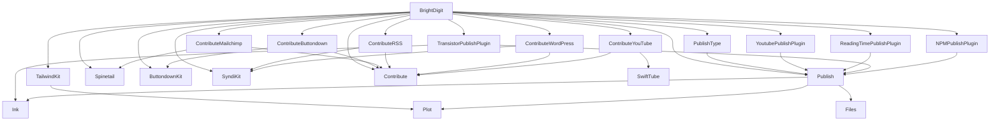

# Merge & Tag — De-vendoring the Package Graph

**Goal:** turn the 20 first-party packages into standalone versioned packages
consumed by `.package(url:…, from:…)`. Tag **bottom-up by wave**: a package can
only be tagged once every in-repo package it depends on already has a release.

**Root checkpoint PR (stays open until every first-party dep is a released tag):**
[brightdigit.com#161](https://github.com/brightdigit/brightdigit.com/pull/161)
on `release/branch-based-devendoring`.

Within a wave, packages can proceed in parallel. Do not tag a package until every
in-repo dependency it needs is already tagged.

> **~~Coordinated landing~~ — discharged 2026-07-24.** brightdigit/Contribute
> [#19](https://github.com/brightdigit/Contribute/pull/19) is **merged** (`a749708`), followed by
> [#18](https://github.com/brightdigit/Contribute/pull/18) (CI comments only), so Contribute
> `main` is now **`2d346bd`**. The pairing constraint no longer applies: ContributeWordPress #18
> can land on its own.
>
> What #19 actually shipped differs from the original plan — the download stack went to
> **`async`/`await`** rather than `@escaping @Sendable` completions, and ContributeWordPress's
> data race is now fixed **structurally** by `withThrowingTaskGroup` instead of by a lock
> (`AssetDownloadErrors.swift` is deleted). See *GCD removal* below.

---

## Current checkpoint

`Packages/` is intentionally absent. The root consumes every first-party package
via URL + branch pins in [`Package.swift`](Package.swift) /
[`Package.resolved`](Package.resolved).

### Root pins (2026-07-24)

| Branch | Packages |
| --- | --- |
| `main` | Contribute (`2d346bd`), Spinetail, ButtondownKit, SyndiKit (+ transitive Plot, Files, Ink, SwiftTube) |
| `brightdigit-com-260406` | Publish, YoutubePublishPlugin, ReadingTimePublishPlugin, NPMPublishPlugin, TransistorPublishPlugin, ContributeWordPress |
| `brightdigit-com-260717` | TailwindKit, ContributeButtondown, ContributeMailchimp, ContributeRSS, ContributeYouTube, PublishType |

All eight Wave 0 packages are on **`main`** (release PRs `v1.0.0` → `main` merged).
Stale `v1.0.0` branches may still exist but are not the consumer pin. Plot/Files/Ink
working branches (`brightdigit-com-260406`) are **deleted**. Root and Wave 1/2
consumers pin Wave 0 deps to `branch: "main"` — completed 2026-07-23 across the root
and the eight Wave 1/2 packages that consume a Wave 0 package (Publish,
TransistorPublishPlugin, ContributeWordPress, TailwindKit, ContributeButtondown,
ContributeMailchimp, ContributeRSS, ContributeYouTube). YoutubePublishPlugin,
ReadingTimePublishPlugin, NPMPublishPlugin and PublishType needed no change — their
only first-party dep is Publish (Wave 1). Dual-mode `ensure-remote-deps.sh`
was removed earlier from packages whose manifests already use `url:` + `branch:`.

SwiftPM rejects two branch requirements for the same package
(`error: … required using two different revision-based requirements`), so a Wave 0 dep
must move to `main` in the root **and** every Wave 1/2 consumer in the same step. Follow
the manifest edit with `swift package update`, not `swift package resolve` — resolve
reuses the revisions already in `Package.resolved` and re-reads the old manifests.

---

## Release waves

Computed by topological levelling: everything in a wave depends only on earlier
waves, so a whole wave can be released in parallel. External deps (Yams,
swift-openapi, XMLCoder, swift-markdown, etc.) are already versioned upstream.

| Wave | Tag these (all in parallel) | Why they're ready |
| --- | --- | --- |
| **0** | Plot, Files, Ink, SyndiKit, ButtondownKit, SwiftTube, Spinetail, Contribute | No in-repo package deps — the leaves |
| **1** | Publish, TailwindKit, ContributeButtondown, ContributeMailchimp, ContributeRSS, ContributeWordPress, ContributeYouTube | Depend only on Wave 0 |
| **2** | PublishType, YoutubePublishPlugin, ReadingTimePublishPlugin, TransistorPublishPlugin, NPMPublishPlugin | Depend on Publish (Wave 1); Transistor also on Ink |
| **3** | BrightDigit (root) | Aggregation hub — depends on all 16 first-party packages |


`brightdigitwg`, `BrightDigitArgs`, `BrightDigitSite`, and `BrightDigitPodcast` are
**targets of the single root BrightDigit package**, not separate packages.

---

## Package → dependencies

### Root
- **BrightDigit** → Publish, YoutubePublishPlugin, ReadingTimePublishPlugin, TailwindKit, Spinetail, ButtondownKit, SyndiKit, NPMPublishPlugin, Contribute, ContributeButtondown, ContributeMailchimp, ContributeRSS, ContributeYouTube, ContributeWordPress, PublishType, TransistorPublishPlugin (16 local) + Yams, ConfigKeyKit, swift-configuration (external)

### Importer family
- **Contribute** → Yams, SwiftSoup, swift-markdown (external)
- **ContributeButtondown** → Contribute, ButtondownKit
- **ContributeMailchimp** → Contribute, Spinetail
- **ContributeRSS** → Contribute, SyndiKit
- **ContributeWordPress** → Contribute, SyndiKit
- **ContributeYouTube** → Contribute, SwiftTube

### Site libraries & plugins
- **PublishType** → Publish
- **TailwindKit** → Plot
- **YoutubePublishPlugin** → Publish
- **ReadingTimePublishPlugin** → Publish
- **TransistorPublishPlugin** → Publish, Ink
- **NPMPublishPlugin** → Publish, swift-subprocess (external)

### API-client packages
- **ButtondownKit** / **SwiftTube** / **Spinetail** → swift-openapi-runtime, swift-openapi-urlsession, swift-http-types (external)
- **SyndiKit** → XMLCoder (external)

### Publish stack
- **Publish** → Ink, Plot, Files
- **Ink** → swift-markdown (external)
- **Plot** / **Files** → *(none)*



---

## Process: release a package

For each package, in wave order:

1. **Land the release branch** — `v1.0.0` (or next semver line) holds the code to ship; open one PR `v1.0.0` → `main`.
2. **Rewrite in-repo deps to `from:`** — only for packages that still have branch/path pins to earlier-wave packages; every dep must already be tagged.
3. **Verify standalone** — `swift build` / CI green without dual-mode path rewrites.
4. **Tag & release** — cut the next semver tag on the package repo and push it.
5. **Bump consumers** — later waves point at the new tag when they run.

### Ordering constraints

1. Never tag a package before all its in-repo deps are tagged.
2. Rewrite deps → build standalone → then tag.
3. Root is always last.
4. Untagged packages begin at `1.0.0-alpha.1` (or `1.0.0` when that is the release line); existing stable releases receive patch bumps; prerelease lines advance. Confirm with `git ls-remote --tags` before choosing.

### Dual-mode `ensure-remote-deps.sh` (historical)

Early Wave 1 used a path→`url`+`revision` rewrite so standalone CI could resolve
while monorepo manifests still used `path:`. **Publish** moved to permanent
`url:` pins early; Wave 1/2 packages that already declare `url:` + `branch:` must
**not** run the rewrite script (it exits when no path deps remain). Those scripts
and workflow steps were removed in the 2026-07-22 `v1.0.0` consumer cutover.

---

## Living checklist

### Wave 0 — leaves (on `main`; untagged)

| Package | Repo | Branch | Release PR (merged) |
| --- | --- | --- | --- |
| Plot | https://github.com/brightdigit/Plot | `main` | [#4](https://github.com/brightdigit/Plot/pull/4) |
| Files | https://github.com/brightdigit/Files | `main` | [#5](https://github.com/brightdigit/Files/pull/5) |
| Ink | https://github.com/brightdigit/Ink | `main` | [#8](https://github.com/brightdigit/Ink/pull/8) |
| SyndiKit | https://github.com/brightdigit/SyndiKit | `main` | [#133](https://github.com/brightdigit/SyndiKit/pull/133) |
| ButtondownKit | https://github.com/brightdigit/ButtondownKit | `main` | [#9](https://github.com/brightdigit/ButtondownKit/pull/9) |
| SwiftTube | https://github.com/brightdigit/SwiftTube | `main` | [#16](https://github.com/brightdigit/SwiftTube/pull/16) |
| Spinetail | https://github.com/brightdigit/Spinetail | `main` | [#28](https://github.com/brightdigit/Spinetail/pull/28) |
| Contribute | https://github.com/brightdigit/Contribute | `main` | [#5](https://github.com/brightdigit/Contribute/pull/5) |

Merge/feedback history (done): Plot #1/#2, Files #3/#2, Ink #1/#3/#5/#6, SyndiKit #129/#130,
SwiftTube #18/#19, Spinetail #31/#32, Contribute #14/#15/#13. No new `1.0.0` /
`v1.0.0` **tags** cut yet (ancient Files `1.0.0` from 2017 does not count).

SwiftTube/Spinetail OpenAPI rebuild renamed public types (Spinetail
`MailchimpCampaign` → `Campaign`; SwiftTube Videos rename); consumers adopted the
new names when repinning.

**SyndiKit Android CI:** on-device tests for the Swift 6.4 nightly Android SDK fail
with `not executable: 64-bit ELF file` on the emulator (6.3 passes). Workaround
merged in [#138](https://github.com/brightdigit/SyndiKit/pull/138)
(`android-run-tests: false`); re-enable tracked in
[#137](https://github.com/brightdigit/SyndiKit/issues/137).

**Wave 0 hygiene follow-ups (2026-07-24) — Contribute #19 and #18 MERGED; the rest still open.**

- ✅ **Contribute → Swift 6.4 + async download stack**
  ([#19](https://github.com/brightdigit/Contribute/pull/19), **merged** `a749708`):
  Contribute declared `swift-tools-version 5.8` (advertised 5.8+ but CI only ever tested
  6.4 nightly). Raised to `6.4` to match the stack. The strict-concurrency fixes went
  **further than originally planned**: rather than hardening completion handlers with
  `@escaping @Sendable`, the whole download stack
  (`URLSessionable`/`URLDownloader`/`FileURLDownloader`) became `async throws`, backed by
  Foundation's native `URLSession.download(from:)`. `#if !os(WASI)` guards were added
  (`URLSession`/`URLResponse` don't exist there; a remote URL now throws
  `URLDownloaderError.networkUnavailable`) — Contribute sets `ENABLE_WASM=false` because Yams
  can't build for wasm, so the guards were verified by cross-compiling the download stack as a
  standalone wasm target. Also a behavior fix: the old code discarded the session error when a
  destination URL was returned. Platform floors unchanged
  (`.macOS(.v12)/.iOS(.v13)/.tvOS(.v13)/.watchOS(.v6)`). 15/15 CI green on `165dfc4`.
- ✅ **Stale CI-comment cleanup for Contribute**
  ([#18](https://github.com/brightdigit/Contribute/pull/18), **merged** → `2d346bd`).
- **Stale CI-comment cleanup, still open** (comment-only): Plot
  [#5](https://github.com/brightdigit/Plot/pull/5), Files
  [#6](https://github.com/brightdigit/Files/pull/6), Ink
  [#9](https://github.com/brightdigit/Ink/pull/9), SwiftTube
  [#23](https://github.com/brightdigit/SwiftTube/pull/23), Spinetail
  [#36](https://github.com/brightdigit/Spinetail/pull/36) — drop a dead
  "brightdigit fork of swift-coverage-action" comment (Contribute only; the step is
  `sersoft-gmbh/swift-coverage-action@v5`) and a phantom `ENABLE_WATCHOS` gate comment
  (no repo references `vars.ENABLE_WATCHOS`). All builds green.
- **⚠ Plot / Files / Ink `claude-review` fails** on every PR: those three repos lack the
  `CLAUDE_CODE_OAUTH_TOKEN` repo secret (SwiftTube/Spinetail/Contribute have it and pass).
  Add the secret or grant an org secret to the three repos — needs the token value +
  `admin:org`. Pre-existing; not caused by any change here.
- **⚠ SyndiKit has no `build-macos-platforms` job** — the only Wave 0 repo with no
  iOS/tvOS/watchOS/visionOS simulator coverage. Its wide Swift matrix (5.10→6.3 + 6.4
  nightly) is correct for its 5.10 floor; adding a sim suite is a separate decision.

### `header.sh` — two versions

`Scripts/header.sh` is a local-only lint step. Two versions, same skeleton, different header text:

| Version | Repos | Emits | Invocation |
| --- | --- | --- | --- |
| **BrightDigit** | non-fork packages | `//` block: filename + package, Leo Dion / BrightDigit MIT | `header.sh -d Sources -c "Leo Dion" -o "BrightDigit" -p "<Package>"` |
| **Sundell forks** | Plot, Files, Ink | Compact `/**` John Sundell block | `header.sh -d Sources -c "John Sundell" -o "John Sundell" -p "<Package>" -y <year>` (Plot 2021, Ink 2020, Files 2019) |

Canonical fork script: [`reference/sundell-fork/Scripts/header.sh`](reference/sundell-fork/Scripts/header.sh).
The Sundell strip must preserve `///` doc comments (do not match `///` when clearing `//` lines).

### Wave 1 — depend only on Wave 0

**Ready to merge** — pending Leo's review of all seven PRs (2026-07-24). Every Wave 1 package
pins its Wave 0 deps to `branch: "main"` with a refreshed `Package.resolved`.

**CI status (2026-07-24), verified against each PR's current head:**

| PR | Head | CI |
| --- | --- | --- |
| ContributeWordPress #18 | `b1658cb` | ✅ green — Ubuntu **45/45**, nightly-6.4 source-compat, Windows ×2, Android, 4 Apple sims. One pre-existing `CodeFactor` advisory ("3 issues found", identical on the two prior commits — static analysis, not a build failure). |
| Publish #1 | `dd7e7af` | ✅ green — Ubuntu **86/86**, nightly-6.4 source-compat, Windows ×2, Android, 4 Apple sims. Still marked **draft**. |
| TailwindKit #1, ContributeButtondown #1, ContributeMailchimp #1, ContributeRSS #1, ContributeYouTube #1 | — | last verified during the 2026-07-24 hygiene pass; re-confirm before merging. |

Publish's Linux leg is the notable one: the `DispatchSemaphore`/`ResultBox`/`TagCache` removal had
only ever been checked on macOS, and Ubuntu now runs the full 86-test suite clean — no deadlock,
no hang. The known ContributeWordPress test bug
([#19](https://github.com/brightdigit/ContributeWordPress/issues/19),
`testFailedCreateDirectory` vs. root in a container) did **not** fire in CI; it remains latent.

**Hygiene pass landed on all seven working branches (2026-07-24), PRs left in their
original draft state.** Each repo was brought to the Wave 0 standard (CI hygiene,
`.claude/` tooling, `AGENTS.md` + `CLAUDE.md` symlink, unified README/badges, DocC + logo,
`.spi.yml` `swift_version: "6.4"`, `.swift-version` `6.4.x-snapshot`, `dependabot.yml`) —
no merges, no tags, no branch deletions, no root repin. Highlights:
- **ContributeYouTube / ContributeMailchimp un-deprecated.** Both carried blanket
  `@available(*, deprecated)` (added in `1e3a815`) with no replacement while the root
  actively compiles them; swift-testing also hard-errors on `@Suite`/`@Test` under a
  deprecated declaration, blocking tests. All 17 attributes removed, real tests added
  (27 / 17). Rule ("in active use ⇒ tested ⇒ not deprecated") recorded in each repo's
  `.claude/agent-notes.md`.
- **ContributeWordPress:** `.swift-version` `5.8`→`6.4.x-snapshot` (resolves the drift
  noted under *Open item*), `.spi.yml` target-name typo (`ContributeWordpress`) fixed,
  and a **real pre-existing data race fixed** in `AssetDownloader` (see the coordinated-
  landing note below). Kept its existing `Documentation.docc` name.
- **Publish** (Sundell fork): copyright headers normalized to 2021 (were 2019/2020, so
  `lint.sh -y 2021` produced a recurring 80-file diff) and an MIT-attribution hazard in
  `lint.sh` (`-c "Leo Dion" -o "BrightDigit"` on a Sundell fork) fixed. Restricted fork
  scope: README `+2/-0`, LICENSE untouched, no DocC/badge-block.
- **TailwindKit:** the two non-green checks were dead `macos-12` workflows
  (`DangerPR.yml`, `TailwindKitTest.yml`) stuck pending forever; deleting them made the
  PR green. Added the missing `LICENSE` and `.spi.yml`.

Full record: [`.claude/memory/wave1-hygiene-pass.md`](.claude/memory/wave1-hygiene-pass.md).

| Package | Repo | Branch | Merge PR | Base | Ahead | Wave 0 deps |
| --- | --- | --- | --- | --- | --- | --- |
| Publish | https://github.com/brightdigit/Publish | `brightdigit-com-260406` | [#1](https://github.com/brightdigit/Publish/pull/1) | `main` | +19 | Ink, Plot, Files |
| TailwindKit | https://github.com/brightdigit/TailwindKit | `brightdigit-com-260717` | [#1](https://github.com/brightdigit/TailwindKit/pull/1) | `main` | +13 | Plot |
| ContributeButtondown | https://github.com/brightdigit/ContributeButtondown | `brightdigit-com-260717` | [#1](https://github.com/brightdigit/ContributeButtondown/pull/1) | `main` | +14 | Contribute, ButtondownKit |
| ContributeMailchimp | https://github.com/brightdigit/ContributeMailchimp | `brightdigit-com-260717` | [#1](https://github.com/brightdigit/ContributeMailchimp/pull/1) | `main` | +15 | Contribute, Spinetail |
| ContributeRSS | https://github.com/brightdigit/ContributeRSS | `brightdigit-com-260717` | [#1](https://github.com/brightdigit/ContributeRSS/pull/1) | `main` | +14 | Contribute, SyndiKit |
| ContributeWordPress | https://github.com/brightdigit/ContributeWordPress | `brightdigit-com-260406` | [#18](https://github.com/brightdigit/ContributeWordPress/pull/18) ⚠ | `main` | +23 | Contribute, SyndiKit |
| ContributeYouTube | https://github.com/brightdigit/ContributeYouTube | `brightdigit-com-260717` | [#1](https://github.com/brightdigit/ContributeYouTube/pull/1) | `main` | +14 | Contribute, SwiftTube |

All seven PRs are open and **MERGEABLE**, and in every repo the base branch is a
strict ancestor of the working branch (no divergence, no conflicts) — "Ahead" is how
many commits the working branch adds. Use the existing PRs; do not open new ones.
"Ahead" counts predate the 2026-07-24 hygiene commits and are now higher.

#### GCD removal (2026-07-24) — supersedes the `NSLock` plan

`AssetDownloader` fanned downloads over a `DispatchGroup`, every completion writing an
unsynchronized `[URL: Error]`; with the real `FileURLDownloader` those callbacks arrive
concurrently on `URLSession`'s delegate queue, so the writes raced (`group.wait()` orders only
the final read). The originally-planned fix guarded that dictionary with an `NSLock`
(`AssetDownloadErrors.swift`).

**That file is now deleted.** `withThrowingTaskGroup` removes the shared state instead of
guarding it: each child returns its own `(URL, any Error)?` and the parent collects at the join
point, where there is no concurrency to synchronize. `Downloader.download` and
`MarkdownProcessor.begin` are `async throws`; `Sources/wpublish/main.swift` became a `@main`
type in `WPublish.swift` (top-level code cannot `await`). Two more `NSLock`s disappeared from the
test doubles (`FileDownloaderSpy`, `AssetDownloaderSpy` are now actors). A regression test fans
out 200 failing downloads and asserts every error survives.

Publish lost the last GCD in the graph: the synchronous `publish` overloads, their
`DispatchSemaphore`, and the `Mutex`-backed `ResultBox` are deleted (the async overloads already
existed and consumers already used them), and `PublishingContext`'s `TagCache` `Mutex` is gone —
`allTags` is computed on demand.

**Files keeps its `Mutex`** (`Sources/Storage.swift`) by decision: `File`/`Folder` are structs
wrapping a `final class Storage` so `move`/`rename` mutate through a `let`. Removing it means
either an actor (async on every path accessor, `AsyncSequence` children) or value semantics (a
breaking API change). Deferred to
[brightdigit.com#162](https://github.com/brightdigit/brightdigit.com/issues/162).

**⚠ Lockfile trap.** ContributeWordPress #18's CI was red on every platform with
`stored property 'urlDownloader' … has non-Sendable type 'any URLDownloader'` — its committed
`Package.resolved` still pinned Contribute at `5dc9049` (pre-merge `main`) even though the
manifest says `branch: "main"`. SwiftPM honours the lockfile revision. Fixed in `b1658cb`.
Local builds could not see it because Contribute was in `swift package edit` mode, which drops
the dependency from `Package.resolved` and substitutes a working copy — **passing local tests
say nothing about what CI resolves.** Check every Wave 1 PR's lockfile pins against what its
manifest branch actually points to.

**TailwindKit's old park does not block this merge.** That park was scoped to
`git subrepo pull` / `push --all` snagging: its standalone `main` carried an older,
superseded implementation with no common ancestor, so pulling would re-import those
files into the monorepo. Merging pushes the correct content the other way — PR #1
explicitly **deletes** all five stale files (`Flexbox.swift`, `Layout/AspectRatio.swift`,
`Layout/Display.swift`, `Shared/Breakpoints.swift`, `TailwindKit.swift`), leaving no
orphans. Landing it makes `main` authoritative and retires the divergence. Its `.gitrepo`
commit is still stale at `bcb0a7f7`, which matters only when `Packages/` is restored.

Also: ContributeWordPress [#11](https://github.com/brightdigit/ContributeWordPress/pull/11) docs (draft).

#### Merge order

Merge **Publish first**, then the other six in any order (or in parallel). Publish is
the only Wave 1 package that Wave 2 consumes, so landing it first unblocks Wave 2; the
six Contribute*/TailwindKit packages have no in-repo consumers within Wave 1.

#### Per-repo checklist

1. **Confirm CI is green** on the PR head.
2. **Merge the PR** into the base branch. These are true fast-forwards, so any merge
   strategy works — but prefer a **merge commit** over squash: a squash rewrites the
   branch tip, which orphans the `.gitrepo` parent refs used when `Packages/` is
   restored (recover with `./fix-subrepo-parents.sh` if it happens).
3. **Do not delete the working branch yet.** The root still pins Wave 1/2 packages to
   `brightdigit-com-*`; deleting the branch would break root resolution. Delete only
   after the root is repinned.
4. **Repin consumers to `main`** once a package is merged — the root and any Wave 2
   package that depends on it, in the same step (see the SwiftPM note below), followed
   by `swift package update` in each.

#### Open item

- ~~Publish's default branch is `master`~~ — **resolved 2026-07-23:** renamed to `main`.
  PR #1 auto-retargeted and remains MERGEABLE.
- **`.swift-version` drift.** ~~TransistorPublishPlugin and ContributeWordPress pin
  toolchain `5.8`~~ — ContributeWordPress fixed to `6.4.x-snapshot` in the 2026-07-24
  hygiene pass. **TransistorPublishPlugin still pins `5.8`**; every other repo and the
  root use `6.4.x-snapshot`. CI passes today, but `swift package update` fails locally
  under swiftly there until the toolchain is overridden
  (`swiftly run swift package update +6.4.x-snapshot-…`).

#### Repin gotchas (learned in the Wave 0 cutover)

SwiftPM refuses two branch requirements for one package
(`error: … required using two different revision-based requirements`), so when a Wave 1
package moves to `main`, **every consumer must move in the same step** — the root and
each Wave 2 dependent together, not one at a time.

After any repin, run **`swift package update`**, not `swift package resolve`: resolve
reuses the revisions already in `Package.resolved` and keeps reading the old manifests.
Commit the regenerated lockfile **in the same commit as the manifest edit** — a stale
lockfile hard-fails any CI leg that runs with automatic resolution disabled
(`error: an out-of-date resolved file was detected`). Note `swift package update` also
floats external semver-range deps; use `swift package update <name>` to limit the blast
radius.

### Wave 2 — Publish plugins / type layer

| Package | Repo | Branch | Merge PR |
| --- | --- | --- | --- |
| PublishType | https://github.com/brightdigit/PublishType | `brightdigit-com-260717` | [#1](https://github.com/brightdigit/PublishType/pull/1) |
| YoutubePublishPlugin | https://github.com/brightdigit/YoutubePublishPlugin | `brightdigit-com-260406` | [#1](https://github.com/brightdigit/YoutubePublishPlugin/pull/1) |
| ReadingTimePublishPlugin | https://github.com/brightdigit/ReadingTimePublishPlugin | `brightdigit-com-260406` | [#1](https://github.com/brightdigit/ReadingTimePublishPlugin/pull/1) |
| TransistorPublishPlugin | https://github.com/brightdigit/TransistorPublishPlugin | `brightdigit-com-260406` | [#6](https://github.com/brightdigit/TransistorPublishPlugin/pull/6) |
| NPMPublishPlugin | https://github.com/brightdigit/NPMPublishPlugin | `brightdigit-com-260406` | [#9](https://github.com/brightdigit/NPMPublishPlugin/pull/9) |

### Wave 3 — root cutover

| Package | Repo | Branch / PR |
| --- | --- | --- |
| BrightDigit (root) | https://github.com/brightdigit/brightdigit.com | [`release/branch-based-devendoring`](https://github.com/brightdigit/brightdigit.com/tree/release/branch-based-devendoring) · [#161](https://github.com/brightdigit/brightdigit.com/pull/161) |

After every Wave 0–2 package is tagged, rewrite root `Package.swift` branch pins to
`from:` versions, verify build/test/publish, then merge #161. Subsequent development
rebases onto `main` and restores subrepos for `v2.0.0-alpha.2`.

---

## Progress tracker

Mark: ☐ todo · ◐ on `main` (release PR merged; untagged) · ✅ tagged `vX.Y.Z`  
⏭ = parked · ⚠ = open milestoned issue work

**Wave 0:** ◐ Plot · ◐ Files · ◐ Ink · ◐ SyndiKit · ◐ ButtondownKit · ◐ SwiftTube · ◐ Spinetail · ◐ Contribute — on `main`; **none ✅ tagged**

**Wave 1:** all seven consume Wave 0 from `branch: "main"` with refreshed lockfiles; each has an
open MERGEABLE PR **awaiting Leo's review** (see the Wave 1 section). Hygiene pass landed on all
seven branches 2026-07-24; six PRs are still drafts. The Contribute #19 pairing constraint is
**discharged** — #19 is merged, so ContributeWordPress #18 lands on its own.
☐ Publish (CI ✅) · ☐ TailwindKit · ☐ ContributeButtondown · ☐ ContributeMailchimp · ☐ ContributeRSS · ☐ ContributeWordPress (CI ✅) · ☐ ContributeYouTube

**Wave 2:** ☐ PublishType ⚠ [#135](https://github.com/brightdigit/brightdigit.com/issues/135) · ☐ YoutubePublishPlugin · ☐ ReadingTimePublishPlugin · ☐ TransistorPublishPlugin · ☐ NPMPublishPlugin

**Wave 3:** ☐ BrightDigit ⚠ [#129](https://github.com/brightdigit/brightdigit.com/issues/129) [#50](https://github.com/brightdigit/brightdigit.com/issues/50) [#70](https://github.com/brightdigit/brightdigit.com/issues/70) [#135](https://github.com/brightdigit/brightdigit.com/issues/135) [#140](https://github.com/brightdigit/brightdigit.com/issues/140) [#92](https://github.com/brightdigit/brightdigit.com/issues/92)

---

## Quick clone list (HTTPS)

```text
https://github.com/brightdigit/Plot.git
https://github.com/brightdigit/Files.git
https://github.com/brightdigit/Ink.git
https://github.com/brightdigit/SyndiKit.git
https://github.com/brightdigit/ButtondownKit.git
https://github.com/brightdigit/SwiftTube.git
https://github.com/brightdigit/Spinetail.git
https://github.com/brightdigit/Contribute.git
https://github.com/brightdigit/Publish.git
https://github.com/brightdigit/TailwindKit.git
https://github.com/brightdigit/ContributeButtondown.git
https://github.com/brightdigit/ContributeMailchimp.git
https://github.com/brightdigit/ContributeRSS.git
https://github.com/brightdigit/ContributeWordPress.git
https://github.com/brightdigit/ContributeYouTube.git
https://github.com/brightdigit/PublishType.git
https://github.com/brightdigit/YoutubePublishPlugin.git
https://github.com/brightdigit/ReadingTimePublishPlugin.git
https://github.com/brightdigit/TransistorPublishPlugin.git
https://github.com/brightdigit/NPMPublishPlugin.git
```

Re-check stale PR links with `gh pr list -R brightdigit/<repo>`.
