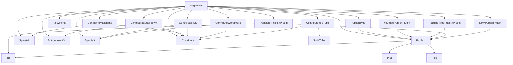

# Merge & Tag — De-vendoring the Package Graph

**Goal:** turn the 20 first-party packages into standalone versioned packages
consumed by `.package(url:…, from:…)`. Tag **bottom-up by wave**: a package can
only be tagged once every in-repo package it depends on already has a release.

**Root checkpoint PR (stays open until every first-party dep is a released tag):**
[brightdigit.com#161](https://github.com/brightdigit/brightdigit.com/pull/161)
on `release/branch-based-devendoring`.

Within a wave, packages can proceed in parallel. Do not tag a package until every
in-repo dependency it needs is already tagged.

> **~~Coordinated landing~~ — discharged 2026-07-24.** brightdigit/Contribute
> [#19](https://github.com/brightdigit/Contribute/pull/19) is **merged** (`a749708`), followed by
> [#18](https://github.com/brightdigit/Contribute/pull/18) (CI comments only), so Contribute
> `main` is now **`2d346bd`**. The pairing constraint no longer applies: ContributeWordPress #18
> can land on its own.
>
> What #19 actually shipped differs from the original plan — the download stack went to
> **`async`/`await`** rather than `@escaping @Sendable` completions, and ContributeWordPress's
> data race is now fixed **structurally** by `withThrowingTaskGroup` instead of by a lock
> (`AssetDownloadErrors.swift` is deleted). See *GCD removal* below.

---

## Where things stand (2026-07-28)

**All 20 packages are squashed, CI-verified, and tagged. The root resolves entirely
against released tags — no `branch:` pins remain anywhere in the graph.**

- **Wave 0:** all eight tagged. Ink and Contribute were **recut** after their first tags
  (see *Recut: branch deps inside a release tag*).
- **Wave 1:** all seven tagged, each with its own first-party deps repinned to Wave 0 tags
  in the same release commit.
- **Wave 2:** all five tagged, repinned to Publish `1.0.0-alpha.1` (and Ink for
  TransistorPublishPlugin).
- **Wave 3:** root repinned to all 20 tags; `swift build`, `swift test`, and
  `swift run brightdigitwg publish --mode production` all pass in debug **and** release
  (451 HTML pages, content check clean). Root CI green on `1a3ef033` — `build-linux`,
  `lint`, `package-linux`, `deploy` all succeeded. PR #161 is `CLEAN` / `MERGEABLE`.
- **Releases:** all 20 GitHub releases published, each marked prerelease.

What remains: (1) merge #161 — note its base is `phase-05`, **not** `main`; (2) restore
subrepos for `v2.0.0-alpha.2`; (3) cleanup — re-enable branch protection + signed commits
on TransistorPublishPlugin and NPMPublishPlugin (disabled for the Wave 2 force-push),
revoke `RELEASE_PAT`, and delete the 20 `backup/pre-squash-260727` refs once the merge
lands (they are the rollback path until then).

### Recut: branch deps inside a release tag

Ink `1.0.0-alpha.1` and Contribute `1.0.0-beta.1` were tagged with `branch:` dependency
pins still in their manifests. **SwiftPM only lets a version-resolved package depend on
other version-resolved packages**, so those tags were unconsumable via `from:`:

```
error: … 'contribute' is required using a stable-version but 'contribute' depends on
       an unstable-version package 'swiftsoup'
```

Both were recut — amend the release commit, force-push, then move the tag with
`push --force` (never delete-then-create, which leaves a window where the tag is absent):

| Package | Was | Now |
| --- | --- | --- |
| Ink | swift-markdown `branch: "main"` | `from: "0.8.0"` |
| Contribute | `brightdigit/SwiftSoup` @ `fix/swift-6.4-inline-crash` | `scinfu/SwiftSoup` `from: "2.13.7"` |
| Contribute | swift-markdown `branch: "main"` | `from: "0.8.0"` |

Two things learned the hard way:

- **`revision:` does not help** — it counts as unstable-version too. Only a real version
  pin satisfies the rule.
- **`exact:` cannot take a snapshot tag.** `exact: "swift-DEVELOPMENT-SNAPSHOT-…"` fails at
  manifest *evaluation* with `Invalid semantic version string`. swift-markdown does publish
  semver tags (through `0.8.0`) — an earlier note claiming otherwise was wrong.

Dropping the SwiftSoup fork means giving up its `@inline(__always)` patch. Upstream 2.13.7
still declares that attribute, but the surrounding code was rewritten and the crash no
longer reproduces: `swift build -c release` + `swift test -c release` both pass.

> **Orphan repos silently skip CI.** The shared workflow has
> `paths-ignore: ['**.md', 'LICENSE']`. An orphan-mode rewrite has no common ancestor, so
> GitHub sees a markdown-only diff and never runs the build — leaving a *stale green* run
> on pre-rewrite history that reads as passing. All five orphan repos (ButtondownKit,
> the four Contribute\*, PublishType) needed `gh workflow run <Repo>.yml --ref main`.
> `Scripts/tag-release.sh` refuses to tag unless the newest run is on the exact tip.

### Squash + tag tooling

Three scripts drive a release pass, all reading
[`Scripts/release-versions.tsv`](Scripts/release-versions.tsv) — the canonical table of
repo, wave, boundary commit, version, rewrite mode, resulting tip, and `done` stamp — and
all supporting `--dry-run` / `--repo` / `--wave` / `--all`:

```bash
NOTES_DIR=path/to/notes Scripts/squash-release.sh --wave 0   # squash + repin  (RELEASE_PAT)
Scripts/tag-release.sh --wave 0                              # tag             (RELEASE_PAT)
NOTES_DIR=path/to/notes Scripts/publish-releases.sh --wave 0 # GitHub releases (gh)
```

`squash-release.sh` pushes `backup/pre-squash-260727` before touching anything, then in a
**single commit** flattens history, installs `$NOTES_DIR/<Repo>.md` as `RELEASE_NOTES.md`,
and repins the repo's own first-party deps to earlier-wave tags. It aborts if any
dependency is not yet tagged, if a `branch:`/`revision:` pin survives the rewrite, or if
the diff against the old tip touches anything beyond `Package.swift`, `Package.resolved`,
and `RELEASE_NOTES.md` — a wrong boundary would otherwise silently drop upstream history.

`tag-release.sh` refuses to tag unless the repo carries a `done` stamp, its tip is
unmoved, and its **own** build workflow is green on that exact SHA.

Both skip repos already marked `done`, so a partial run is safe to re-run. **Update the
`done` column immediately after each wave** — `expect_tip` is rewritten to the post-squash
SHA, so the tip check alone will not stop a second squash.

`NOTES_DIR` has no default: the 2026-07 notes shipped into each package's own
`RELEASE_NOTES.md`, so the staging copies were deleted rather than left to drift. To
re-create a release from what shipped, fetch them back:

```bash
curl -sfo notes/<Repo>.md \
  https://raw.githubusercontent.com/brightdigit/<Repo>/main/RELEASE_NOTES.md
```

Recover any repo from its backup ref with:

```bash
git push --force origin refs/heads/backup/pre-squash-260727:main
```

## Current checkpoint

`Packages/` is intentionally absent. The root consumes every first-party package
via URL + **version** pins in [`Package.swift`](Package.swift) /
[`Package.resolved`](Package.resolved) — see the
[progress tracker](#progress-tracker) for the released version of each.

All working branches (`brightdigit-com-*`) are **deleted**. Five root pins still referenced
them until the 2026-07-28 repin, which is why the root could not resolve from a clean
checkout: the branches had been removed when their PRs merged.

`from:` resolves these prereleases as long as the requirement itself names one
(`from: "1.0.0-alpha.1"`); no `exact:` fallback was needed anywhere in the graph.

Two ordering rules that mattered during the cutover, kept because they bite again on any
future branch-based checkpoint:

- SwiftPM rejects two branch requirements for the same package
  (`error: … required using two different revision-based requirements`), so a shared dep
  must move in the root **and** in every consumer in the same step.
- Follow a manifest edit with `swift package update`, not `swift package resolve` — resolve
  reuses the revisions already in `Package.resolved` and re-reads the old manifests.

---

## Release waves

Computed by topological levelling: everything in a wave depends only on earlier
waves, so a whole wave can be released in parallel. External deps (Yams,
swift-openapi, XMLCoder, swift-markdown, etc.) are already versioned upstream.

| Wave | Tag these (all in parallel) | Why they're ready |
| --- | --- | --- |
| **0** | Plot, Files, Ink, SyndiKit, ButtondownKit, SwiftTube, Spinetail, Contribute | No in-repo package deps — the leaves |
| **1** | Publish, TailwindKit, ContributeButtondown, ContributeMailchimp, ContributeRSS, ContributeWordPress, ContributeYouTube | Depend only on Wave 0 (TailwindKit now has **no** deps at all — it could tag with Wave 0, but stays here since nothing depends on it landing earlier) |
| **2** | PublishType, YoutubePublishPlugin, ReadingTimePublishPlugin, TransistorPublishPlugin, NPMPublishPlugin | Depend on Publish (Wave 1); Transistor also on Ink |
| **3** | BrightDigit (root) | Aggregation hub — depends on all 16 first-party packages |

### Version table

Canonical form lives in [`Scripts/release-versions.tsv`](Scripts/release-versions.tsv).
`1.0.0-alpha.1` is **not** usable everywhere: it is already taken in Contribute, Spinetail and
ContributeWordPress, and would be a semver *downgrade* in Files and the three packages already
shipping `1.0.0`. Tags are unprefixed; commit messages carry the `v`.

| Wave | Package | Highest existing tag | New tag |
| --- | --- | --- | --- |
| 0 | Plot | `0.14.0` | `1.0.0-alpha.1` |
| 0 | Files | `4.3.0` | **`5.0.0-alpha.1`** |
| 0 | Ink | `0.6.0` | `1.0.0-alpha.1` |
| 0 | SyndiKit | `0.8.1` | `1.0.0-alpha.1` |
| 0 | ButtondownKit | *(none)* | `1.0.0-alpha.1` |
| 0 | SwiftTube | `0.2.0-beta.5` | `1.0.0-alpha.1` |
| 0 | Spinetail | `1.0.0-alpha.2` | **`1.0.0-beta.1`** |
| 0 | Contribute | `1.0.0-alpha.5` | **`1.0.0-beta.1`** |
| 1 | Publish | *(none)* | `1.0.0-alpha.1` |
| 1 | TailwindKit | *(none)* | `1.0.0-alpha.1` |
| 1 | ContributeButtondown | *(none)* | `1.0.0-alpha.1` |
| 1 | ContributeMailchimp | *(none)* | `1.0.0-alpha.1` |
| 1 | ContributeRSS | *(none)* | `1.0.0-alpha.1` |
| 1 | ContributeWordPress | `1.0.0` | **`2.0.0-alpha.1`** |
| 1 | ContributeYouTube | *(none)* | `1.0.0-alpha.1` |
| 2 | PublishType | *(none)* | `1.0.0-alpha.1` |
| 2 | YoutubePublishPlugin | `0.1.0` | `1.0.0-alpha.1` |
| 2 | ReadingTimePublishPlugin | `0.3.0` | `1.0.0-alpha.1` |
| 2 | TransistorPublishPlugin | `1.0.0` | **`2.0.0-alpha.1`** |
| 2 | NPMPublishPlugin | `1.0.0` | **`2.0.0-alpha.1`** |

Contribute's and Spinetail's old alpha tags sit on **diverged** history (`gh api compare` →
`"status":"diverged"`), so those lines were abandoned — a further reason not to continue them.
ContributeWordPress's `1.0.0` *is* a true ancestor of `main`.

> **SwiftPM prerelease caveat.** `from:` does not resolve to a prerelease unless the requirement
> itself names one, so every root pin must carry the full prerelease string
> (`from: "1.0.0-alpha.1"`). Fall back to `exact:` if resolution refuses — which is what
> `ConfigKeyKit` already uses in the root manifest.


`brightdigitwg`, `BrightDigitArgs`, `BrightDigitSite`, and `BrightDigitPodcast` are
**targets of the single root BrightDigit package**, not separate packages.

---

## Package → dependencies

### Root
- **BrightDigit** → Publish, YoutubePublishPlugin, ReadingTimePublishPlugin, TailwindKit, Spinetail, ButtondownKit, SyndiKit, NPMPublishPlugin, Contribute, ContributeButtondown, ContributeMailchimp, ContributeRSS, ContributeYouTube, ContributeWordPress, PublishType, TransistorPublishPlugin (16 local) + Yams, ConfigKeyKit, swift-configuration (external)

### Importer family
- **Contribute** → Yams, SwiftSoup, swift-markdown (external)
- **ContributeButtondown** → Contribute, ButtondownKit
- **ContributeMailchimp** → Contribute, Spinetail
- **ContributeRSS** → Contribute, SyndiKit
- **ContributeWordPress** → Contribute, SyndiKit
- **ContributeYouTube** → Contribute, SwiftTube

### Site libraries & plugins
- **PublishType** → Publish
- **TailwindKit** → *(none)* — dropped Plot 2026-07-26; the `TailwindClassAttribute`
  seam moves the binding to the consumer, so it now has no dependencies at all
- **YoutubePublishPlugin** → Publish
- **ReadingTimePublishPlugin** → Publish
- **TransistorPublishPlugin** → Publish, Ink
- **NPMPublishPlugin** → Publish, swift-subprocess (external)

### API-client packages
- **ButtondownKit** / **SwiftTube** / **Spinetail** → swift-openapi-runtime, swift-openapi-urlsession, swift-http-types (external)
- **SyndiKit** → XMLCoder (external)

### Publish stack
- **Publish** → Ink, Plot, Files
- **Ink** → swift-markdown (external)
- **Plot** / **Files** → *(none)*



---

## Wave 1 review fixes (2026-07-26)

Five review comments across three of the seven Wave 1 PRs — all addressed before those
PRs merged. Detail lives in the PR threads; the durable outcomes (Splash removal, the
GCD → `Synchronization.Mutex` migration) are recorded in `AGENTS.md` and the packages
themselves.

## Process: release a package

For each package, in wave order:

1. **Land the release branch** — `v1.0.0` (or next semver line) holds the code to ship; open one PR `v1.0.0` → `main`.
2. **Rewrite in-repo deps to `from:`** — only for packages that still have branch/path pins to earlier-wave packages; every dep must already be tagged.
3. **Verify standalone** — `swift build` / CI green without dual-mode path rewrites.
4. **Tag & release** — cut the next semver tag on the package repo and push it.
5. **Bump consumers** — later waves point at the new tag when they run.

### Ordering constraints

1. Never tag a package before all its in-repo deps are tagged.
2. Rewrite deps → build standalone → then tag.
3. Root is always last.
4. Versions follow the [version table](#version-table) — **not** a uniform `1.0.0-alpha.1`.
   The rule: a stable `1.0.0`+ already exists → next major, alpha line; only a prerelease
   line exists → advance that line to beta; `0.x` with no stable → `1.0.0-alpha.1`.
   Confirm with `git ls-remote --tags` before choosing.

### Dual-mode `ensure-remote-deps.sh` (historical)

Early Wave 1 used a path→`url`+`revision` rewrite so standalone CI could resolve
while monorepo manifests still used `path:`. **Publish** moved to permanent
`url:` pins early; Wave 1/2 packages that already declare `url:` + `branch:` must
**not** run the rewrite script (it exits when no path deps remain). Those scripts
and workflow steps were removed in the 2026-07-22 `v1.0.0` consumer cutover.

---

## Living checklist

**Complete.** All 20 packages were squashed, CI-verified, tagged, and released on
2026-07-27/28; the root now resolves entirely against those tags. The per-package merge
choreography this section used to track (release-PR links, branch names, per-repo
checkboxes) is finished and has been removed — see the [progress tracker](#progress-tracker)
for the shipped versions and `Scripts/release-versions.tsv` for the commit each tag points at.

Anything still outstanding is listed under [Where things stand](#where-things-stand-2026-07-28).

## Progress tracker

Mark: ☐ todo · ◐ on `main` (release PR merged; untagged) · ✅ tagged `vX.Y.Z`  
⏭ = parked · ⚠ = open milestoned issue work

**Wave 0:** ✅ Plot `1.0.0-alpha.1` · ✅ Files `5.0.0-alpha.1` · ✅ Ink `1.0.0-alpha.1` (recut) · ✅ SyndiKit `1.0.0-alpha.1` · ✅ ButtondownKit `1.0.0-alpha.1` · ✅ SwiftTube `1.0.0-alpha.1` · ✅ Spinetail `1.0.0-beta.1` · ✅ Contribute `1.0.0-beta.1` (recut) — **all tagged 2026-07-27**

**Wave 1:** ✅ Publish `1.0.0-alpha.1` · ✅ TailwindKit `1.0.0-alpha.1` · ✅ ContributeButtondown `1.0.0-alpha.1` · ✅ ContributeMailchimp `1.0.0-alpha.1` · ✅ ContributeRSS `1.0.0-alpha.1` · ✅ ContributeWordPress `2.0.0-alpha.1` · ✅ ContributeYouTube `1.0.0-alpha.1` — **all tagged 2026-07-27**; each repinned to Wave 0 tags in its own release commit

**Wave 2:** ✅ PublishType `1.0.0-alpha.1` ⚠ [#135](https://github.com/brightdigit/brightdigit.com/issues/135) · ✅ YoutubePublishPlugin `1.0.0-alpha.1` · ✅ ReadingTimePublishPlugin `1.0.0-alpha.1` · ✅ TransistorPublishPlugin `2.0.0-alpha.1` · ✅ NPMPublishPlugin `2.0.0-alpha.1` — **all tagged 2026-07-28**; all repinned to Publish `1.0.0-alpha.1`

**Wave 3:** ☐ BrightDigit ⚠ [#129](https://github.com/brightdigit/brightdigit.com/issues/129) [#50](https://github.com/brightdigit/brightdigit.com/issues/50) [#70](https://github.com/brightdigit/brightdigit.com/issues/70) [#135](https://github.com/brightdigit/brightdigit.com/issues/135) [#140](https://github.com/brightdigit/brightdigit.com/issues/140) [#92](https://github.com/brightdigit/brightdigit.com/issues/92)

---

## Quick clone list (HTTPS)

```text
https://github.com/brightdigit/Plot.git
https://github.com/brightdigit/Files.git
https://github.com/brightdigit/Ink.git
https://github.com/brightdigit/SyndiKit.git
https://github.com/brightdigit/ButtondownKit.git
https://github.com/brightdigit/SwiftTube.git
https://github.com/brightdigit/Spinetail.git
https://github.com/brightdigit/Contribute.git
https://github.com/brightdigit/Publish.git
https://github.com/brightdigit/TailwindKit.git
https://github.com/brightdigit/ContributeButtondown.git
https://github.com/brightdigit/ContributeMailchimp.git
https://github.com/brightdigit/ContributeRSS.git
https://github.com/brightdigit/ContributeWordPress.git
https://github.com/brightdigit/ContributeYouTube.git
https://github.com/brightdigit/PublishType.git
https://github.com/brightdigit/YoutubePublishPlugin.git
https://github.com/brightdigit/ReadingTimePublishPlugin.git
https://github.com/brightdigit/TransistorPublishPlugin.git
https://github.com/brightdigit/NPMPublishPlugin.git
```

Re-check stale PR links with `gh pr list -R brightdigit/<repo>`.
