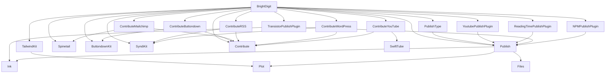

# Merge & Tag — De-vendoring the Package Graph

**Goal:** turn the 20 first-party packages into standalone versioned packages
consumed by `.package(url:…, from:…)`. Tag **bottom-up by wave**: a package can
only be tagged once every in-repo package it depends on already has a release.

**Root checkpoint PR (stays open until every first-party dep is a released tag):**
[brightdigit.com#161](https://github.com/brightdigit/brightdigit.com/pull/161)
on `release/branch-based-devendoring`.

Within a wave, packages can proceed in parallel. Do not tag a package until every
in-repo dependency it needs is already tagged.

---

## Current checkpoint

`Packages/` is intentionally absent. The root consumes every first-party package
via URL + branch pins in [`Package.swift`](Package.swift) /
[`Package.resolved`](Package.resolved).

### Root pins (2026-07-23)

| Branch | Packages |
| --- | --- |
| `main` | Contribute, Spinetail, ButtondownKit, SyndiKit (+ transitive Plot, Files, Ink, SwiftTube) |
| `brightdigit-com-260406` | Publish, YoutubePublishPlugin, ReadingTimePublishPlugin, NPMPublishPlugin, TransistorPublishPlugin, ContributeWordPress |
| `brightdigit-com-260717` | TailwindKit, ContributeButtondown, ContributeMailchimp, ContributeRSS, ContributeYouTube, PublishType |

All eight Wave 0 packages are on **`main`** (release PRs `v1.0.0` → `main` merged).
Stale `v1.0.0` branches may still exist but are not the consumer pin. Plot/Files/Ink
working branches (`brightdigit-com-260406`) are **deleted**. Root and Wave 1/2
consumers pin Wave 0 deps to `branch: "main"` — completed 2026-07-23 across the root
and the eight Wave 1/2 packages that consume a Wave 0 package (Publish,
TransistorPublishPlugin, ContributeWordPress, TailwindKit, ContributeButtondown,
ContributeMailchimp, ContributeRSS, ContributeYouTube). YoutubePublishPlugin,
ReadingTimePublishPlugin, NPMPublishPlugin and PublishType needed no change — their
only first-party dep is Publish (Wave 1). Dual-mode `ensure-remote-deps.sh`
was removed earlier from packages whose manifests already use `url:` + `branch:`.

SwiftPM rejects two branch requirements for the same package
(`error: … required using two different revision-based requirements`), so a Wave 0 dep
must move to `main` in the root **and** every Wave 1/2 consumer in the same step. Follow
the manifest edit with `swift package update`, not `swift package resolve` — resolve
reuses the revisions already in `Package.resolved` and re-reads the old manifests.

---

## Release waves

Computed by topological levelling: everything in a wave depends only on earlier
waves, so a whole wave can be released in parallel. External deps (Yams,
swift-openapi, XMLCoder, swift-markdown, etc.) are already versioned upstream.

| Wave | Tag these (all in parallel) | Why they're ready |
| --- | --- | --- |
| **0** | Plot, Files, Ink, SyndiKit, ButtondownKit, SwiftTube, Spinetail, Contribute | No in-repo package deps — the leaves |
| **1** | Publish, TailwindKit, ContributeButtondown, ContributeMailchimp, ContributeRSS, ContributeWordPress, ContributeYouTube | Depend only on Wave 0 |
| **2** | PublishType, YoutubePublishPlugin, ReadingTimePublishPlugin, TransistorPublishPlugin, NPMPublishPlugin | Depend on Publish (Wave 1); Transistor also on Ink |
| **3** | BrightDigit (root) | Aggregation hub — depends on all 16 first-party packages |


`brightdigitwg`, `BrightDigitArgs`, `BrightDigitSite`, and `BrightDigitPodcast` are
**targets of the single root BrightDigit package**, not separate packages.

---

## Package → dependencies

### Root
- **BrightDigit** → Publish, YoutubePublishPlugin, ReadingTimePublishPlugin, TailwindKit, Spinetail, ButtondownKit, SyndiKit, NPMPublishPlugin, Contribute, ContributeButtondown, ContributeMailchimp, ContributeRSS, ContributeYouTube, ContributeWordPress, PublishType, TransistorPublishPlugin (16 local) + Yams, ConfigKeyKit, swift-configuration (external)

### Importer family
- **Contribute** → Yams, SwiftSoup, swift-markdown (external)
- **ContributeButtondown** → Contribute, ButtondownKit
- **ContributeMailchimp** → Contribute, Spinetail
- **ContributeRSS** → Contribute, SyndiKit
- **ContributeWordPress** → Contribute, SyndiKit
- **ContributeYouTube** → Contribute, SwiftTube

### Site libraries & plugins
- **PublishType** → Publish
- **TailwindKit** → Plot
- **YoutubePublishPlugin** → Publish
- **ReadingTimePublishPlugin** → Publish
- **TransistorPublishPlugin** → Publish, Ink
- **NPMPublishPlugin** → Publish, swift-subprocess (external)

### API-client packages
- **ButtondownKit** / **SwiftTube** / **Spinetail** → swift-openapi-runtime, swift-openapi-urlsession, swift-http-types (external)
- **SyndiKit** → XMLCoder (external)

### Publish stack
- **Publish** → Ink, Plot, Files
- **Ink** → swift-markdown (external)
- **Plot** / **Files** → *(none)*



---

## Process: release a package

For each package, in wave order:

1. **Land the release branch** — `v1.0.0` (or next semver line) holds the code to ship; open one PR `v1.0.0` → `main`.
2. **Rewrite in-repo deps to `from:`** — only for packages that still have branch/path pins to earlier-wave packages; every dep must already be tagged.
3. **Verify standalone** — `swift build` / CI green without dual-mode path rewrites.
4. **Tag & release** — cut the next semver tag on the package repo and push it.
5. **Bump consumers** — later waves point at the new tag when they run.

### Ordering constraints

1. Never tag a package before all its in-repo deps are tagged.
2. Rewrite deps → build standalone → then tag.
3. Root is always last.
4. Untagged packages begin at `1.0.0-alpha.1` (or `1.0.0` when that is the release line); existing stable releases receive patch bumps; prerelease lines advance. Confirm with `git ls-remote --tags` before choosing.

### Dual-mode `ensure-remote-deps.sh` (historical)

Early Wave 1 used a path→`url`+`revision` rewrite so standalone CI could resolve
while monorepo manifests still used `path:`. **Publish** moved to permanent
`url:` pins early; Wave 1/2 packages that already declare `url:` + `branch:` must
**not** run the rewrite script (it exits when no path deps remain). Those scripts
and workflow steps were removed in the 2026-07-22 `v1.0.0` consumer cutover.

---

## Living checklist

### Wave 0 — leaves (on `main`; untagged)

| Package | Repo | Branch | Release PR (merged) |
| --- | --- | --- | --- |
| Plot | https://github.com/brightdigit/Plot | `main` | [#4](https://github.com/brightdigit/Plot/pull/4) |
| Files | https://github.com/brightdigit/Files | `main` | [#5](https://github.com/brightdigit/Files/pull/5) |
| Ink | https://github.com/brightdigit/Ink | `main` | [#8](https://github.com/brightdigit/Ink/pull/8) |
| SyndiKit | https://github.com/brightdigit/SyndiKit | `main` | [#133](https://github.com/brightdigit/SyndiKit/pull/133) |
| ButtondownKit | https://github.com/brightdigit/ButtondownKit | `main` | [#9](https://github.com/brightdigit/ButtondownKit/pull/9) |
| SwiftTube | https://github.com/brightdigit/SwiftTube | `main` | [#16](https://github.com/brightdigit/SwiftTube/pull/16) |
| Spinetail | https://github.com/brightdigit/Spinetail | `main` | [#28](https://github.com/brightdigit/Spinetail/pull/28) |
| Contribute | https://github.com/brightdigit/Contribute | `main` | [#5](https://github.com/brightdigit/Contribute/pull/5) |

Merge/feedback history (done): Plot #1/#2, Files #3/#2, Ink #1/#3/#5/#6, SyndiKit #129/#130,
SwiftTube #18/#19, Spinetail #31/#32, Contribute #14/#15/#13. No new `1.0.0` /
`v1.0.0` **tags** cut yet (ancient Files `1.0.0` from 2017 does not count).

SwiftTube/Spinetail OpenAPI rebuild renamed public types (Spinetail
`MailchimpCampaign` → `Campaign`; SwiftTube Videos rename); consumers adopted the
new names when repinning.

**SyndiKit Android CI:** on-device tests for the Swift 6.4 nightly Android SDK fail
with `not executable: 64-bit ELF file` on the emulator (6.3 passes). Workaround
merged in [#138](https://github.com/brightdigit/SyndiKit/pull/138)
(`android-run-tests: false`); re-enable tracked in
[#137](https://github.com/brightdigit/SyndiKit/issues/137).

### `header.sh` — two versions

`Scripts/header.sh` is a local-only lint step. Two versions, same skeleton, different header text:

| Version | Repos | Emits | Invocation |
| --- | --- | --- | --- |
| **BrightDigit** | non-fork packages | `//` block: filename + package, Leo Dion / BrightDigit MIT | `header.sh -d Sources -c "Leo Dion" -o "BrightDigit" -p "<Package>"` |
| **Sundell forks** | Plot, Files, Ink | Compact `/**` John Sundell block | `header.sh -d Sources -c "John Sundell" -o "John Sundell" -p "<Package>" -y <year>` (Plot 2021, Ink 2020, Files 2019) |

Canonical fork script: [`reference/sundell-fork/Scripts/header.sh`](reference/sundell-fork/Scripts/header.sh).
The Sundell strip must preserve `///` doc comments (do not match `///` when clearing `//` lines).

### Wave 1 — depend only on Wave 0

**Ready to merge.** Every Wave 1 package now pins its Wave 0 deps to `branch: "main"`
with a refreshed `Package.resolved` and green CI, so nothing blocks landing these
branches on their default branch.

| Package | Repo | Branch | Merge PR | Base | Ahead | Wave 0 deps |
| --- | --- | --- | --- | --- | --- | --- |
| Publish | https://github.com/brightdigit/Publish | `brightdigit-com-260406` | [#1](https://github.com/brightdigit/Publish/pull/1) | **`master`** | +19 | Ink, Plot, Files |
| TailwindKit | https://github.com/brightdigit/TailwindKit | `brightdigit-com-260717` | [#1](https://github.com/brightdigit/TailwindKit/pull/1) | `main` | +13 | Plot |
| ContributeButtondown | https://github.com/brightdigit/ContributeButtondown | `brightdigit-com-260717` | [#1](https://github.com/brightdigit/ContributeButtondown/pull/1) | `main` | +14 | Contribute, ButtondownKit |
| ContributeMailchimp | https://github.com/brightdigit/ContributeMailchimp | `brightdigit-com-260717` | [#1](https://github.com/brightdigit/ContributeMailchimp/pull/1) | `main` | +15 | Contribute, Spinetail |
| ContributeRSS | https://github.com/brightdigit/ContributeRSS | `brightdigit-com-260717` | [#1](https://github.com/brightdigit/ContributeRSS/pull/1) | `main` | +14 | Contribute, SyndiKit |
| ContributeWordPress | https://github.com/brightdigit/ContributeWordPress | `brightdigit-com-260406` | [#18](https://github.com/brightdigit/ContributeWordPress/pull/18) | `main` | +23 | Contribute, SyndiKit |
| ContributeYouTube | https://github.com/brightdigit/ContributeYouTube | `brightdigit-com-260717` | [#1](https://github.com/brightdigit/ContributeYouTube/pull/1) | `main` | +14 | Contribute, SwiftTube |

All seven PRs are open and **MERGEABLE**, and in every repo the base branch is a
strict ancestor of the working branch (no divergence, no conflicts) — "Ahead" is how
many commits the working branch adds. Use the existing PRs; do not open new ones.

⏭ **TailwindKit is parked** in the progress tracker. It is technically ready to merge
like the rest, but confirm the park is lifted before landing it.

Also: ContributeWordPress [#11](https://github.com/brightdigit/ContributeWordPress/pull/11) docs (draft).

#### Merge order

Merge **Publish first**, then the other six in any order (or in parallel). Publish is
the only Wave 1 package that Wave 2 consumes, so landing it first unblocks Wave 2; the
six Contribute*/TailwindKit packages have no in-repo consumers within Wave 1.

#### Per-repo checklist

1. **Confirm CI is green** on the PR head.
2. **Merge the PR** into the base branch. These are true fast-forwards, so any merge
   strategy works — but prefer a **merge commit** over squash: a squash rewrites the
   branch tip, which orphans the `.gitrepo` parent refs used when `Packages/` is
   restored (recover with `./fix-subrepo-parents.sh` if it happens).
3. **Do not delete the working branch yet.** The root still pins Wave 1/2 packages to
   `brightdigit-com-*`; deleting the branch would break root resolution. Delete only
   after the root is repinned.
4. **Repin consumers to `main`** once a package is merged — the root and any Wave 2
   package that depends on it, in the same step (see the SwiftPM note below), followed
   by `swift package update` in each.

#### Two blockers to decide before merging

- **Publish's default branch is `master`, and the repo has no `main`.** Every other
  first-party repo uses `main`. Decide whether to (a) merge into `master` and leave the
  inconsistency, or (b) rename `master` → `main` first (updates the PR base
  automatically; workflow `branches:` filters and any consumer pinning `master` need a
  look). This choice does not block the other six.
- **`.swift-version` drift.** TransistorPublishPlugin and ContributeWordPress pin
  toolchain `5.8`; every other repo and the root use `6.4.x-snapshot`. CI passes today,
  but `swift package update` fails locally under swiftly in those two repos until the
  toolchain is overridden (`swiftly run swift package update +6.4.x-snapshot-…`).

#### Repin gotchas (learned in the Wave 0 cutover)

SwiftPM refuses two branch requirements for one package
(`error: … required using two different revision-based requirements`), so when a Wave 1
package moves to `main`, **every consumer must move in the same step** — the root and
each Wave 2 dependent together, not one at a time.

After any repin, run **`swift package update`**, not `swift package resolve`: resolve
reuses the revisions already in `Package.resolved` and keeps reading the old manifests.
Commit the regenerated lockfile **in the same commit as the manifest edit** — a stale
lockfile hard-fails any CI leg that runs with automatic resolution disabled
(`error: an out-of-date resolved file was detected`). Note `swift package update` also
floats external semver-range deps; use `swift package update <name>` to limit the blast
radius.

### Wave 2 — Publish plugins / type layer

| Package | Repo | Branch | Merge PR |
| --- | --- | --- | --- |
| PublishType | https://github.com/brightdigit/PublishType | `brightdigit-com-260717` | [#1](https://github.com/brightdigit/PublishType/pull/1) |
| YoutubePublishPlugin | https://github.com/brightdigit/YoutubePublishPlugin | `brightdigit-com-260406` | [#1](https://github.com/brightdigit/YoutubePublishPlugin/pull/1) |
| ReadingTimePublishPlugin | https://github.com/brightdigit/ReadingTimePublishPlugin | `brightdigit-com-260406` | [#1](https://github.com/brightdigit/ReadingTimePublishPlugin/pull/1) |
| TransistorPublishPlugin | https://github.com/brightdigit/TransistorPublishPlugin | `brightdigit-com-260406` | [#6](https://github.com/brightdigit/TransistorPublishPlugin/pull/6) |
| NPMPublishPlugin | https://github.com/brightdigit/NPMPublishPlugin | `brightdigit-com-260406` | [#9](https://github.com/brightdigit/NPMPublishPlugin/pull/9) |

### Wave 3 — root cutover

| Package | Repo | Branch / PR |
| --- | --- | --- |
| BrightDigit (root) | https://github.com/brightdigit/brightdigit.com | [`release/branch-based-devendoring`](https://github.com/brightdigit/brightdigit.com/tree/release/branch-based-devendoring) · [#161](https://github.com/brightdigit/brightdigit.com/pull/161) |

After every Wave 0–2 package is tagged, rewrite root `Package.swift` branch pins to
`from:` versions, verify build/test/publish, then merge #161. Subsequent development
rebases onto `main` and restores subrepos for `v2.0.0-alpha.2`.

---

## Progress tracker

Mark: ☐ todo · ◐ on `main` (release PR merged; untagged) · ✅ tagged `vX.Y.Z`  
⏭ = parked · ⚠ = open milestoned issue work

**Wave 0:** ◐ Plot · ◐ Files · ◐ Ink · ◐ SyndiKit · ◐ ButtondownKit · ◐ SwiftTube · ◐ Spinetail · ◐ Contribute — on `main`; **none ✅ tagged**

**Wave 1:** all seven consume Wave 0 from `branch: "main"` with refreshed lockfiles and
green CI; each has an open MERGEABLE PR awaiting merge (see the Wave 1 section).
☐ Publish (base `master`) · ⏭ TailwindKit · ☐ ContributeButtondown · ☐ ContributeMailchimp · ☐ ContributeRSS · ☐ ContributeWordPress · ☐ ContributeYouTube

**Wave 2:** ☐ PublishType ⚠ [#135](https://github.com/brightdigit/brightdigit.com/issues/135) · ☐ YoutubePublishPlugin · ☐ ReadingTimePublishPlugin · ☐ TransistorPublishPlugin · ☐ NPMPublishPlugin

**Wave 3:** ☐ BrightDigit ⚠ [#129](https://github.com/brightdigit/brightdigit.com/issues/129) [#50](https://github.com/brightdigit/brightdigit.com/issues/50) [#70](https://github.com/brightdigit/brightdigit.com/issues/70) [#135](https://github.com/brightdigit/brightdigit.com/issues/135) [#140](https://github.com/brightdigit/brightdigit.com/issues/140) [#92](https://github.com/brightdigit/brightdigit.com/issues/92)

---

## Quick clone list (HTTPS)

```text
https://github.com/brightdigit/Plot.git
https://github.com/brightdigit/Files.git
https://github.com/brightdigit/Ink.git
https://github.com/brightdigit/SyndiKit.git
https://github.com/brightdigit/ButtondownKit.git
https://github.com/brightdigit/SwiftTube.git
https://github.com/brightdigit/Spinetail.git
https://github.com/brightdigit/Contribute.git
https://github.com/brightdigit/Publish.git
https://github.com/brightdigit/TailwindKit.git
https://github.com/brightdigit/ContributeButtondown.git
https://github.com/brightdigit/ContributeMailchimp.git
https://github.com/brightdigit/ContributeRSS.git
https://github.com/brightdigit/ContributeWordPress.git
https://github.com/brightdigit/ContributeYouTube.git
https://github.com/brightdigit/PublishType.git
https://github.com/brightdigit/YoutubePublishPlugin.git
https://github.com/brightdigit/ReadingTimePublishPlugin.git
https://github.com/brightdigit/TransistorPublishPlugin.git
https://github.com/brightdigit/NPMPublishPlugin.git
```

Re-check stale PR links with `gh pr list -R brightdigit/<repo>`.
