# Swift Package Dependency Graph & Release Order

**Purpose:** these packages are currently vendored and consumed **by path**
(`.package(path: …)`). This document exists to decide the order in which to **merge and tag**
them as standalone versioned packages. The rule is topological: a package can only be tagged
once every package it depends on has already been tagged (you can't point a versioned
`.package(url:…, from:…)` at a dependency that has no release yet). So **tag the independent
leaves first and work up to the hub.** The [Release order](#release-order-merge--tag-waves)
section is the actionable output; the graph and independence ranking below are the
justification.

The unit here is the *package* — each directory with its own `Package.swift` is one node. A
package depends on other **packages** (via `.package(...)`), so the graph and ordering are
strictly package-to-package.

Data is generated authoritatively with `swift package describe --type json` run in each
package (its `dependencies` array = that package's `.package(...)` edges), not by grepping
manifests. Test-only dependencies that SwiftPM excludes from a package's product
dependency set (e.g. `swift-testing` in `SyndiKit`) are excluded here too.

## Release order (merge & tag waves)

Computed by topological levelling of the package graph: everything in a wave depends only on
packages in **earlier** waves, so an entire wave can be merged + tagged in parallel before
moving to the next. External source-control dependencies (Yams, the swift-openapi stack,
XMLCoder, swift-markdown, etc.) are already versioned upstream and don't constrain the order.

| Wave | Tag these (all in parallel) | Why they're ready |
|---|---|---|
| **0** | `Plot`, `Files`, `Ink`, `SyndiKit`, `ButtondownKit`, `SwiftTube`, `Spinetail`, `Contribute` | Depend on **no** in-repo package (external deps only) — the leaves. |
| **1** | `Publish`, `TailwindKit`, `ContributeButtondown`, `ContributeMailchimp`, `ContributeRSS`, `ContributeWordPress`, `ContributeYouTube` | Depend only on Wave 0 (`Publish`→Ink/Plot/Files; each importer→Contribute + its Wave-0 client; `TailwindKit`→Plot). |
| **2** | `PublishType`, `YoutubePublishPlugin`, `ReadingTimePublishPlugin`, `TransistorPublishPlugin`, `NPMPublishPlugin` | The Publish plugins/type layer — depend on `Publish` (Wave 1), and `TransistorPublishPlugin` also on `Ink` (Wave 0). |
| **3** | `BrightDigit` (root app) | The aggregation hub — depends on all 16 first-party packages; tag/release last. |

> Suggested starting point: **`Plot`** and **`Files`** are absolute leaves (zero
> dependencies of any kind) and `Plot` is heavily depended-upon — tagging it unblocks
> `TailwindKit` and the whole Publish stack. Pair it with `Contribute` (the most
> depended-upon first-party leaf, unblocking all five importers) as the highest-leverage
> first wave.

```mermaid
graph LR
  subgraph W0["Wave 0 — leaves"]
    Plot; Files; Ink; SyndiKit; ButtondownKit; SwiftTube; Spinetail; Contribute
  end
  subgraph W1["Wave 1"]
    Publish; TailwindKit; ContributeButtondown; ContributeMailchimp; ContributeRSS; ContributeWordPress; ContributeYouTube
  end
  subgraph W2["Wave 2"]
    PublishType; YoutubePublishPlugin; ReadingTimePublishPlugin; TransistorPublishPlugin; NPMPublishPlugin
  end
  subgraph W3["Wave 3 — hub"]
    BrightDigit
  end
  W0 --> W1 --> W2 --> W3
```

> Note on the root package: `brightdigitwg`, `BrightDigitArgs`, `BrightDigitSite`, and
> `BrightDigitPodcast` are **targets/products of the single root `BrightDigit` package**, not
> separate packages — likewise `wpublish` is a target inside `ContributeWordPress`. At package
> grain they collapse into their owning package, so this document treats the root as one
> `BrightDigit` node. (A target-level view is a different, finer graph.)

## Packages in this repo (21 total)

- **`BrightDigit`** (root `Package.swift`) — the site generator + CLI; vends the
  `brightdigitwg` executable and `BrightDigitPodcast` library.
- **`Packages/BrightDigit/*`** (15 packages) — the `Contribute*` importer family, the
  `*PublishPlugin` set, `PublishType`, `TailwindKit`, and the API-client packages
  (`ButtondownKit`, `SwiftTube`, `Spinetail`, `SyndiKit`).
- **`Packages/Plugins/ReadingTimePublishPlugin`** — a first-party Publish plugin.
- **`Packages/Publish/*`** (4 packages: `Publish`, `Plot`, `Ink`, `Files`) — the vendored
  Publish framework stack. First-party in this repo, so included as real nodes here.

## Written dependency breakdown (package → packages)

Each line is a package and the packages it declares as dependencies. `(external)` marks a
remote source-control dependency resolved from outside this repo.

### Root
- **`BrightDigit`** → `Publish`, `YoutubePublishPlugin`, `ReadingTimePublishPlugin`,
  `TailwindKit`, `Spinetail`, `ButtondownKit`, `SyndiKit`, `NPMPublishPlugin`, `Contribute`,
  `ContributeButtondown`, `ContributeMailchimp`, `ContributeRSS`, `ContributeYouTube`,
  `ContributeWordPress`, `PublishType`, `TransistorPublishPlugin` (16 local) + `Yams`,
  `ConfigKeyKit`, `swift-configuration` (external) — **19 total**

### Importer family
- **`Contribute`** → `Yams`, `SwiftSoup`, `swift-markdown` (all external) — 3
- **`ContributeButtondown`** → `Contribute`, `ButtondownKit` — 2
- **`ContributeMailchimp`** → `Contribute`, `Spinetail` — 2
- **`ContributeRSS`** → `Contribute`, `SyndiKit` — 2
- **`ContributeWordPress`** → `Contribute`, `SyndiKit` — 2
- **`ContributeYouTube`** → `Contribute`, `SwiftTube` — 2

### Site libraries & plugins
- **`PublishType`** → `Publish` — 1
- **`TailwindKit`** → `Plot` — 1
- **`YoutubePublishPlugin`** → `Publish` — 1
- **`ReadingTimePublishPlugin`** → `Publish` — 1
- **`TransistorPublishPlugin`** → `Publish`, `Ink` — 2
- **`NPMPublishPlugin`** → `Publish`, `swift-subprocess` (external) — 2

### API-client packages
- **`ButtondownKit`** → `swift-openapi-runtime`, `swift-openapi-urlsession`,
  `swift-http-types` (all external) — 3
- **`SwiftTube`** → `swift-openapi-runtime`, `swift-openapi-urlsession`,
  `swift-http-types` (all external) — 3
- **`Spinetail`** → `swift-openapi-runtime`, `swift-openapi-urlsession`,
  `swift-http-types` (all external) — 3
- **`SyndiKit`** → `XMLCoder` (external) — 1

### Vendored Publish stack
- **`Publish`** → `Ink`, `Plot`, `Files` — 3 (all within the stack)
- **`Ink`** → `swift-markdown` (external) — 1
- **`Plot`** → *(none)* — 0
- **`Files`** → *(none)* — 0

## Mermaid dependency graph (packages)

Arrows read **A --> B** as "package A depends on package B". Only in-repo packages are drawn
as nodes; external source-control dependencies (Yams, SwiftSoup, swift-markdown, the
swift-openapi stack, XMLCoder, ConfigKeyKit, swift-configuration, swift-subprocess) are
omitted from the diagram and captured in the breakdown above and the ranking below.

```mermaid
graph TD
  subgraph Root["Root package"]
    BrightDigit
  end

  subgraph Importers["Importer family"]
    Contribute
    ContributeButtondown
    ContributeMailchimp
    ContributeRSS
    ContributeYouTube
    ContributeWordPress
  end

  subgraph SiteLibs["Site libraries & plugins"]
    PublishType
    TailwindKit
    YoutubePublishPlugin
    ReadingTimePublishPlugin
    TransistorPublishPlugin
    NPMPublishPlugin
  end

  subgraph Clients["API-client packages"]
    ButtondownKit
    SwiftTube
    Spinetail
    SyndiKit
  end

  subgraph PublishStack["Vendored Publish stack"]
    Publish
    Ink
    Plot
    Files
  end

  %% Root package edges (local packages only)
  BrightDigit --> Publish
  BrightDigit --> YoutubePublishPlugin
  BrightDigit --> ReadingTimePublishPlugin
  BrightDigit --> TailwindKit
  BrightDigit --> Spinetail
  BrightDigit --> ButtondownKit
  BrightDigit --> SyndiKit
  BrightDigit --> NPMPublishPlugin
  BrightDigit --> Contribute
  BrightDigit --> ContributeButtondown
  BrightDigit --> ContributeMailchimp
  BrightDigit --> ContributeRSS
  BrightDigit --> ContributeYouTube
  BrightDigit --> ContributeWordPress
  BrightDigit --> PublishType
  BrightDigit --> TransistorPublishPlugin

  %% Importer edges
  ContributeButtondown --> Contribute
  ContributeButtondown --> ButtondownKit
  ContributeMailchimp --> Contribute
  ContributeMailchimp --> Spinetail
  ContributeRSS --> Contribute
  ContributeRSS --> SyndiKit
  ContributeWordPress --> Contribute
  ContributeWordPress --> SyndiKit
  ContributeYouTube --> Contribute
  ContributeYouTube --> SwiftTube

  %% Site-lib edges into the Publish stack
  PublishType --> Publish
  TailwindKit --> Plot
  YoutubePublishPlugin --> Publish
  ReadingTimePublishPlugin --> Publish
  TransistorPublishPlugin --> Publish
  TransistorPublishPlugin --> Ink
  NPMPublishPlugin --> Publish

  %% Publish stack internal edges
  Publish --> Ink
  Publish --> Plot
  Publish --> Files
```

## Independence ranking (most independent → least)

"Independence" = the number of packages a package **directly depends on**, counting **both**
in-repo and external dependencies (total fan-out from `swift package describe`). A lower
total means the package needs less to build and can be reasoned about more in isolation —
the most independent. Higher totals mean it pulls in more of the world.

This is the ranking that feeds the [release order](#release-order-merge--tag-waves): the
**in-repo** column is what constrains tagging (external deps are already versioned). Packages
with 0 in-repo deps are the leaves you tag first; the root hub with 16 is tagged last.

| Package | In-repo | External | Total | Independence |
|---|---:|---:|---:|---|
| `Plot` | 0 | 0 | 0 | ●○○○○ fully independent |
| `Files` | 0 | 0 | 0 | ●○○○○ fully independent |
| `TailwindKit` | 1 · Plot | 0 | 1 | ●○○○○ near-independent |
| `PublishType` | 1 · Publish | 0 | 1 | ●○○○○ near-independent |
| `YoutubePublishPlugin` | 1 · Publish | 0 | 1 | ●○○○○ near-independent |
| `ReadingTimePublishPlugin` | 1 · Publish | 0 | 1 | ●○○○○ near-independent |
| `Ink` | 0 | 1 · swift-markdown | 1 | ●○○○○ near-independent |
| `SyndiKit` | 0 | 1 · XMLCoder | 1 | ●○○○○ near-independent |
| `TransistorPublishPlugin` | 2 · Publish, Ink | 0 | 2 | ●●○○○ low coupling |
| `NPMPublishPlugin` | 1 · Publish | 1 · swift-subprocess | 2 | ●●○○○ low coupling |
| `ContributeButtondown` | 2 · Contribute, ButtondownKit | 0 | 2 | ●●○○○ low coupling |
| `ContributeMailchimp` | 2 · Contribute, Spinetail | 0 | 2 | ●●○○○ low coupling |
| `ContributeRSS` | 2 · Contribute, SyndiKit | 0 | 2 | ●●○○○ low coupling |
| `ContributeWordPress` | 2 · Contribute, SyndiKit | 0 | 2 | ●●○○○ low coupling |
| `ContributeYouTube` | 2 · Contribute, SwiftTube | 0 | 2 | ●●○○○ low coupling |
| `Contribute` | 0 | 3 · Yams, SwiftSoup, swift-markdown | 3 | ●●●○○ moderate |
| `ButtondownKit` | 0 | 3 · openapi ×2, HTTPTypes | 3 | ●●●○○ moderate |
| `SwiftTube` | 0 | 3 · openapi ×2, HTTPTypes | 3 | ●●●○○ moderate |
| `Spinetail` | 0 | 3 · openapi ×2, HTTPTypes | 3 | ●●●○○ moderate |
| `Publish` | 3 · Ink, Plot, Files | 0 | 3 | ●●●○○ moderate |
| `BrightDigit` (root) | 16 | 3 · Yams, ConfigKeyKit, swift-configuration | 19 | ●●●●● least independent (hub) |

### Independence tier graph

Nodes grouped into tiers by **total** direct dependency count, so the gradient from most
independent (bottom) to least independent (top) is visible at a glance. Solid edges are
in-repo package dependencies; external dependencies are summarized in the ranking table
rather than drawn.

```mermaid
graph TD
  subgraph Tier5["Least independent — hub (19 total)"]
    BrightDigit
  end

  subgraph Tier3["Moderate (3 total)"]
    Contribute
    ButtondownKit
    SwiftTube
    Spinetail
    Publish
  end

  subgraph Tier2["Low coupling (2 total)"]
    TransistorPublishPlugin
    NPMPublishPlugin
    ContributeButtondown
    ContributeMailchimp
    ContributeRSS
    ContributeWordPress
    ContributeYouTube
  end

  subgraph Tier1["Most independent (0–1 total)"]
    Plot
    Files
    Ink
    SyndiKit
    TailwindKit
    PublishType
    YoutubePublishPlugin
    ReadingTimePublishPlugin
  end

  BrightDigit --> Publish
  BrightDigit --> YoutubePublishPlugin
  BrightDigit --> ReadingTimePublishPlugin
  BrightDigit --> TailwindKit
  BrightDigit --> Spinetail
  BrightDigit --> ButtondownKit
  BrightDigit --> SyndiKit
  BrightDigit --> NPMPublishPlugin
  BrightDigit --> Contribute
  BrightDigit --> ContributeButtondown
  BrightDigit --> ContributeMailchimp
  BrightDigit --> ContributeRSS
  BrightDigit --> ContributeYouTube
  BrightDigit --> ContributeWordPress
  BrightDigit --> PublishType
  BrightDigit --> TransistorPublishPlugin

  ContributeButtondown --> Contribute
  ContributeButtondown --> ButtondownKit
  ContributeMailchimp --> Contribute
  ContributeMailchimp --> Spinetail
  ContributeRSS --> Contribute
  ContributeRSS --> SyndiKit
  ContributeWordPress --> Contribute
  ContributeWordPress --> SyndiKit
  ContributeYouTube --> Contribute
  ContributeYouTube --> SwiftTube

  PublishType --> Publish
  TailwindKit --> Plot
  YoutubePublishPlugin --> Publish
  ReadingTimePublishPlugin --> Publish
  TransistorPublishPlugin --> Publish
  TransistorPublishPlugin --> Ink
  NPMPublishPlugin --> Publish

  Publish --> Ink
  Publish --> Plot
  Publish --> Files
```

> Note: this ranks **direct** dependencies (fan-out). It is an independence/coupling measure,
> not a transitive build-impact measure — e.g. `Contribute` and `Plot` sit near the
> independent end yet are among the most depended-**upon** packages, so a change to either
> ripples widely even though each is itself highly independent.

## Notes

- The package graph is a clean DAG — no dependency cycles.
- `Contribute` is the most depended-upon first-party package (every `Contribute*` importer
  builds on it); `Plot`/`Publish` are the most depended-upon of the vendored stack.
- The root `BrightDigit` package is the aggregation hub — it depends on all 16 first-party
  library packages plus three external dependencies.
- The importer packages form a strikingly regular pattern: each depends on exactly
  `Contribute` + one API-client package.
- Packages under `Packages/` are git-subrepo subrepos — do not edit their manifests or
  `.gitrepo` files. This document lives at the repo root.
- Regenerate the dependency data with `swift package describe --type json` per package
  (its `dependencies` array is the `.package(...)` edge set).
