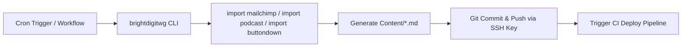
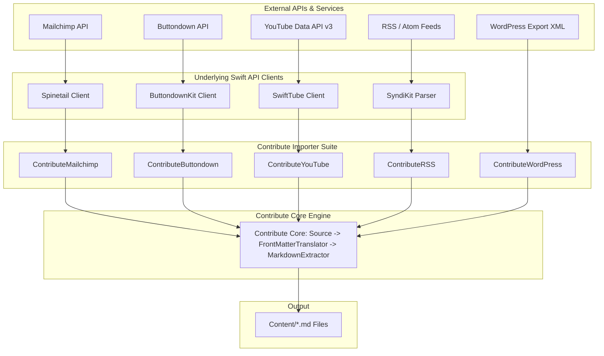
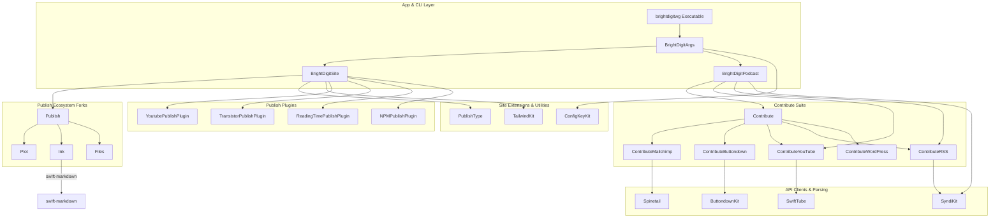

<p align="center">
  <picture>
    <source media="(prefers-color-scheme: dark)" srcset="Resources/media/brightdigit-logo-dark.svg">
    <source media="(prefers-color-scheme: light)" srcset="Resources/media/brightdigit-logo.svg">
    
  </picture>
</p>

# brightdigit.com

The source for [brightdigit.com](https://brightdigit.com) — a static site built entirely in Swift. It generates roughly 450 HTML pages from Markdown: 54 articles, 45 tutorials, 210 podcast episodes, 118 newsletter issues, and 15 product pages, plus RSS feeds and a sitemap.

The purpose of vendoring the entire dependency graph into this repo as git-subrepos was a temporary strategy enabling simultaneous development, migration, and upgrade of all 20 first-party packages to Swift 6.4 with strict concurrency in a single unified environment. Once fully modernized, each package was squashed, tagged, and released to its own repository in dependency order. Today `Package.swift` consumes all 20 first-party packages as ordinary version pins, like any standard SwiftPM project.

This README explains **how the site works**, **how to develop on it**, and **where the project stands**.

- [How the site works](#how-the-site-works)
- [Content automation & Contribute framework](#content-automation--contribute-framework)
- [The Swift package ecosystem](#the-swift-package-ecosystem)
- [External services](#external-services)
- [Working on the site](#working-on-the-site)
- [Project status](#project-status-as-of-2026-08-04)
- [Historical PRs & Key Issues](#historical-prs--key-issues)

---

## How the site works

### One executable, seven commands

Everything is driven by a single executable, `brightdigitwg` (`Sources/brightdigitwg/BrightDigitWG.swift` is a four-line shim). Commands are dispatched by a hand-rolled `CommandDispatcher` built on [ConfigKeyKit](https://github.com/brightdigit/ConfigKeyKit), using declarative `ConfigKey` types layered over [apple/swift-configuration](https://github.com/apple/swift-configuration) so options can come from CLI arguments or environment variables with an explicit precedence contract. There is no default command; dispatch greedily matches the longest registered name:

| Command | What it does |
|---|---|
| `publish --mode <drafts\|production>` | Generate the site into `Output/` |
| `import podcast` | Merge the Transistor RSS feed with YouTube video metadata into episode Markdown |
| `import mailchimp` | Import newsletter campaigns from Mailchimp (legacy platform) |
| `import buttondown` | Import newsletter emails from Buttondown (current platform) |
| `import wordpress` | One-time WordPress-export migration (articles/tutorials) |
| `buttondown reconcile` | Cross-check Mailchimp campaigns against the Buttondown archive; update-only; requires `--preview-directory` or `--execute` |
| `url podcast` | Print episode URLs |

### The publishing pipeline

The site definition lives in `Sources/BrightDigitSite/BrightDigitSite.swift` as a [Publish](https://github.com/brightdigit/Publish) pipeline:

1. Copy `Resources/` (favicons, media, `_redirects`) into `Output/`
2. Install the Transistor and YouTube plugins (they expand shortcodes in Markdown into embedded players)
3. Parse all Markdown in `Content/`
4. In `production` mode, drop future-dated items (`item.date > now`) — this is how posts get scheduled; `drafts` mode keeps everything
5. Sort by date, generate HTML with the custom theme, emit RSS (`/feed.rss`, `/articles.rss`, `/tutorials.rss`) and a sitemap
6. Run the npm step: `npm ci && npm run publish` inside `Styling/`, which webpack-bundles all CSS and JS into a single `js/main.js`

### Content model

`Content/` holds Markdown files organized into five section directories. Each file contains strongly-typed YAML front matter decoded by `ItemMetadata` in `BrightDigitSite.swift`:

| Section | Directory | Creation Source | Key Front-Matter Fields | Purpose |
|---|---|---|---|---|
| Articles | `articles/` | Manual (Hand-written) | `featuredImage`, `technologies` | Technical blog posts & Swift articles |
| Tutorials | `tutorials/` | Manual (Hand-written) | `featuredImage`, `technologies` | In-depth developer tutorials |
| Episodes | `episodes/` | Machine (`import podcast` bot) | `youtubeID`, `audioDuration`, `podcastID` | EmpowerApps.Show podcast episodes |
| Newsletters | `newsletters/` | Machine (`import buttondown` / `import mailchimp`) | `issueNo`, `featuredImage` | Archived newsletter issues |
| Products | `products/` | Manual (Hand-written) | `screenshots`, `featuredImage` | BrightDigit apps & products showcase |

> [!NOTE]
> Top-level pages (`index.md`, `about-us.md`, `services.md`, `contact-us.md`) are lightweight stubs. Their real UI copy lives in Swift at [`Sources/BrightDigitSite/Strings.swift`](Sources/BrightDigitSite/Strings.swift), allowing full type safety and component composition.

### Rendering: type-safe HTML all the way down

HTML is generated with [Plot](https://github.com/brightdigit/Plot), John Sundell's type-safe HTML DSL, through a custom `HTMLFactory` (`PiHTMLFactory.swift`) and a tree of Swift components under `Sources/BrightDigitSite/Components/` and `Nodes/`. The theme utilizes Plot's type-safe `Component` API, ensuring compile-time safety across all generated pages.

CSS classes in Swift go through [TailwindKit](https://github.com/brightdigit/TailwindKit), a type-safe Tailwind v4 class builder — `Div().tailwind(.flex, .justify(.center))` instead of stringly-typed class lists. House rule: TailwindKit models **only officially documented Tailwind v4 utilities**, nothing custom.

### Styling

Tailwind CSS **v4** in CSS-first mode — there is no `tailwind.config.js`. Configuration lives in `@theme` blocks in `Styling/styles/styles.css`, which also carries `@apply` component styles. Syntax highlighting is client-side [highlight.js](https://highlightjs.org), plus [Mermaid](https://mermaid.js.org) for diagrams; webpack bundles everything, with CSS injected by `style-loader`.

---

## Content automation & Contribute framework

### Automated Content Pipeline

CI runs `import mailchimp`, `import podcast`, and `import buttondown` on a six-hour cron (defined in [`.github/workflows/main.yaml`](.github/workflows/main.yaml)). New episodes and newsletters are committed as bot commits — the workflow checkout uses a dedicated SSH deploy key (`CONTENT_DEPLOY_KEY`) rather than `GITHUB_TOKEN`, specifically so the bot's push *does* trigger the CI pipeline and the site redeploys itself. Publishing a podcast episode or newsletter therefore requires zero manual work on the website: it appears on the next cron tick.



### The Contribute Architecture

Content importation is powered by [Contribute](https://github.com/brightdigit/Contribute), a modular framework designed for ingesting external payloads and producing standard Markdown files with front-matter metadata.



The architecture consists of three core abstractions:
- **`Source`**: Fetches raw data from external endpoints via dedicated API client packages.
- **`FrontMatterTranslator`**: Maps raw API response objects into strongly-typed YAML front-matter metadata (`ItemMetadata`).
- **`MarkdownExtractor`**: Generates the Markdown body content and formats the final `.md` file written into `Content/`.

The importer suite pairs `Contribute` with dedicated Swift API client packages:
- [Contribute](https://github.com/brightdigit/Contribute): Core abstractions, protocols, and Markdown file writing utilities.
- [ContributeMailchimp](https://github.com/brightdigit/ContributeMailchimp) $\rightarrow$ powered by [Spinetail](https://github.com/brightdigit/Spinetail) (OpenAPI Mailchimp client).
- [ContributeButtondown](https://github.com/brightdigit/ContributeButtondown) $\rightarrow$ powered by [ButtondownKit](https://github.com/brightdigit/ButtondownKit) (OpenAPI Buttondown client).
- [ContributeYouTube](https://github.com/brightdigit/ContributeYouTube) $\rightarrow$ powered by [SwiftTube](https://github.com/brightdigit/SwiftTube) (OpenAPI YouTube Data API client).
- [ContributeRSS](https://github.com/brightdigit/ContributeRSS) $\rightarrow$ powered by [SyndiKit](https://github.com/brightdigit/SyndiKit) (RSS/Atom/JSON-feed decoder).
- [ContributeWordPress](https://github.com/brightdigit/ContributeWordPress) $\rightarrow$ WordPress export XML translation.

---

## The Swift package ecosystem

The static site generator relies on an ecosystem of 20 first-party packages maintained under [github.com/brightdigit](https://github.com/brightdigit).

### Package Connections & Architecture



### Key Tool Modernizations & Migrations

- **Ink Migration**: Ink's original hand-written parser was replaced with **[swift-markdown](https://github.com/swiftlang/swift-markdown)** under the hood, while preserving Ink's HTML emitter and public API. Call sites resolve any `Markdown` symbol collision via the Swift 6.4 module selector (`Module::Symbol`).
- **ShellOut Migration**: `NPMPublishPlugin` was updated to remove `ShellOut` in favor of `swift-subprocess` for executing Node tasks during the styling build.
- **Strict Concurrency**: All 20 first-party packages run under **Swift 6.4 complete strict concurrency** (`-strict-concurrency=complete`) with zero `@unchecked Sendable` annotations.
- **Files**: Modernized and jumped to `5.0.0-alpha.1` with native Windows path handling.
- **TailwindKit**: Fully decoupled from Foundation and Plot using a lightweight `TailwindClassAttribute` protocol seam.

### First-Party Package Fleet (by Usage Category)

#### Publish Ecosystem & Core Layout

| Package | Role | Description |
|---|---|---|
| [Publish](https://github.com/brightdigit/Publish) | Static Site Engine | Forked and modernized to Swift 6.4 strict concurrency |
| [Plot](https://github.com/brightdigit/Plot) | HTML DSL | Type-safe HTML generation with `Component` API support |
| [Ink](https://github.com/brightdigit/Ink) | Markdown Parser | Powered by `swift-markdown` under the hood |
| [Files](https://github.com/brightdigit/Files) | File System | Cross-platform file handling |
| [PublishType](https://github.com/brightdigit/PublishType) | Publish Abstractions | Type-safe section and page builders for Publish |
| [TailwindKit](https://github.com/brightdigit/TailwindKit) | Styling DSL | Type-safe Tailwind v4 class builder |

#### Contribute Framework & Importers

| Package | Role | Description |
|---|---|---|
| [Contribute](https://github.com/brightdigit/Contribute) | Importer Core | Core data transformation and markdown generation engine |
| [ContributeMailchimp](https://github.com/brightdigit/ContributeMailchimp) | Importer | Mailchimp newsletter campaign ingestion (via Spinetail) |
| [ContributeButtondown](https://github.com/brightdigit/ContributeButtondown) | Importer | Buttondown email newsletter ingestion (via ButtondownKit) |
| [ContributeYouTube](https://github.com/brightdigit/ContributeYouTube) | Importer | YouTube video metadata processing (via SwiftTube) |
| [ContributeRSS](https://github.com/brightdigit/ContributeRSS) | Importer | RSS feed item extraction (via SyndiKit) |
| [ContributeWordPress](https://github.com/brightdigit/ContributeWordPress) | Importer | WordPress export post/page translation |

#### Web Service & API Clients

| Package | Role | Description |
|---|---|---|
| [ButtondownKit](https://github.com/brightdigit/ButtondownKit) | API Client | OpenAPI-generated Buttondown API client |
| [Spinetail](https://github.com/brightdigit/Spinetail) | API Client | OpenAPI-generated Mailchimp API client |
| [SwiftTube](https://github.com/brightdigit/SwiftTube) | API Client | OpenAPI-generated YouTube Data API v3 client |
| [SyndiKit](https://github.com/brightdigit/SyndiKit) | Feed Parser | RSS, Atom, and JSON feed decoding |

#### Publish Runtime Plugins

| Package | Role | Description |
|---|---|---|
| [YoutubePublishPlugin](https://github.com/brightdigit/YoutubePublishPlugin) | Plugin | Expands YouTube shortcodes into embedded video players |
| [TransistorPublishPlugin](https://github.com/brightdigit/TransistorPublishPlugin) | Plugin | Expands Transistor shortcodes into embedded podcast players |
| [ReadingTimePublishPlugin](https://github.com/brightdigit/ReadingTimePublishPlugin) | Plugin | Calculates article and tutorial reading times |
| [NPMPublishPlugin](https://github.com/brightdigit/NPMPublishPlugin) | Plugin | Executes Node Webpack styling build via `swift-subprocess` |

#### CLI & Environment Configuration

| Package | Role | Description |
|---|---|---|
| [ConfigKeyKit](https://github.com/brightdigit/ConfigKeyKit) | CLI / Config | Declarative `ConfigKey` CLI and environment configuration layer |

---

## External services

| Service | Used for | Location in Codebase |
|---|---|---|
| [Netlify](https://netlify.com) | Hosting, deploys (CLI from CI), contact form (`data-netlify`), redirect rules | `netlify.toml`, deploy job |
| [Buttondown](https://buttondown.com/brightdigit) | Newsletter: subscribe form endpoint, public archive, RSS | `Strings.swift`, subscription components |
| Mailchimp | Legacy newsletter platform; import source for historical archive | `import mailchimp` |
| [Transistor.fm](https://transistor.fm) | Podcast hosting for [EmpowerApps.Show](https://www.empowerapps.show): RSS feed, embedded player | `PodcastItem+URLs.swift`, TransistorPublishPlugin |
| YouTube Data API v3 | Video metadata merged into episode pages; thumbnails and embeds | `import podcast`, SwiftTube |
| [Plausible](https://plausible.io) | Privacy-focused web analytics | `Node+Head.swift`, `Styling/scripts/index.ts` |
| Buffer / Twitter / LinkedIn | Social sharing links | `Nodes/Social/` |
| Google Fonts | Cardo, Oxygen, Oxygen Mono font loading | `Styling/styles/styles.css` |
| Docker Hub | `swiftlang/swift:nightly-6.4.x-noble` base image for Linux CI/builds | `Dockerfile` |
| Codecov | Test coverage monitoring | `codecov.yml` |

### GitHub Actions Secrets

| Secret Name | Service / Purpose | CI Job Where Used |
|---|---|---|
| `CONTENT_DEPLOY_KEY` | SSH deploy key (write access) enabling bot pushes to re-trigger CI deploys | `automate-content` |
| `NETLIFY_AUTH_TOKEN` | Authentication token for deploying static output to Netlify | `deploy` |
| `NETLIFY_PRODUCTION_SITE_ID` | Production site identifier for Netlify CLI deployment | `deploy` |
| `MAILCHIMP_API_KEY` | API key for fetching historical newsletter campaign archives | `automate-content` |
| `MAILCHIMP_LIST_ID` | Audience / List ID for Mailchimp newsletter campaign ingestion | `automate-content` |
| `BUTTONDOWN_API_KEY` | API key for importing newly published Buttondown emails | `automate-content` |
| `YOUTUBE_API_KEY` | API key for fetching video metadata via YouTube Data API v3 | `automate-content` |

Secrets are configured under Repository Settings $\rightarrow$ Secrets and variables $\rightarrow$ Actions in GitHub, and read locally via CLI arguments or environment variables (`BUTTONDOWN_API_KEY` etc.).

---

## Working on the site

### Prerequisites

- **Swift 6.4 snapshot toolchain** — `.swift-version` pins `6.4.x-snapshot` (`swiftly install 6.4.x-snapshot` or matching Xcode toolchain). Requires macOS 15+ for local builds (`ConfigKeyKit 1.0.0-beta.2`; Publish stack also uses `Synchronization.Mutex`).
- **[mise](https://mise.jdx.dev)** — provides Node 20, swift-format, SwiftLint, and periphery at pinned versions (`.mise.toml`), and sets `NPM_PATH` required by NPMPublishPlugin.
- Docker / Devcontainer: `.devcontainer/` and `Dockerfile` (based on `swiftlang/swift:nightly-6.4.x-noble`) mirror the CI environment.

### Build, test, run

```bash
# Build and run tests
swift build
swift test

# Generate the site (drafts mode includes future-dated content)
swift run brightdigitwg publish --mode drafts

# Serve the static output locally using Ruby:
ruby -run -e httpd Output -p 8000

# Lint codebase (swift-format + SwiftLint + periphery)
./Scripts/lint.sh

# Scan content quality (report-only)
node Scripts/check-content.js
```

Content edits are plain Markdown under `Content/`; Swift changes to the theme live in `Sources/BrightDigitSite/`. CI builds every PR and pushes a non-production Netlify deploy preview. Development conventions are detailed in [`AGENTS.md`](AGENTS.md).

---

## Project status (as of 2026-08-04)

The **v2.0.0-alpha.2** checkpoint closed out the major modernization arc: Tailwind v4, the Buttondown migration, the Plot component migration, Swift 6.4 strict concurrency across the stack, and the de-vendoring release of all 20 packages.

Work is organized in [`.claude/PRD.md`](.claude/PRD.md) and 13 GitHub milestones:

| Phase | Focus | State |
|---|---|---|
| 1 — Package extraction | Move `Sources/` into a standalone `BrightDigitSite` package repo; formalize repo boundaries | Next up |
| 2 — AI-CITE content optimization | Per-article rewrites following the GEO audit | In progress |
| 3 — Site SEO code | Real `dateModified` sitewide, robots.txt, type-level SEO invariants | Open |
| 5 — Publishing infrastructure | Wire content planning into the publish + fan-out pipeline | Partially done |
| 7 — Platform migration | Netlify → GitHub Pages, form-hosting decisions | Open |
| 8 — Final cleanup | Parallel page generation, periphery config, tech debt | Open |

Sources of truth: [`.claude/PRD.md`](.claude/PRD.md) for the roadmap and rationale, the [milestone board](https://github.com/brightdigit/brightdigit.com/milestones) for live counts, and [`.claude/MERGE-AND-TAG.md`](.claude/MERGE-AND-TAG.md) for the de-vendoring record.

---

## Historical PRs & Key Issues

For posterity, major architectural shifts and milestones are recorded below:

- **#40**: Replaced Ink's custom Markdown parser with `swift-markdown`.
- **#42 & #48**: Vendored initial subrepo dependency graph for strict concurrency modernization.
- **#44**: Replaced `swift-argument-parser` with declarative `ConfigKeyKit` + `swift-configuration`.
- **#144**: Resolved rendered content quality defects and merge field encoding.
- **#147 & #148**: Buttondown migration & API client integration.
- **#150**: Tailwind CSS v4 migration in CSS-first mode.
- **#151**: Swift 6.4 strict concurrency enforcement across Plot, Publish, Ink, and Files.
- **#157**: Migrated Plot theme rendering from `Node` API to `Component` API with zero HTML diffs.
- **#159 & #160**: Multi-platform CI unification across Ubuntu, macOS, Windows, and Android.
- **#161**: Un-vendoring release of all 20 first-party Swift packages.
